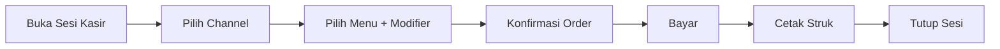
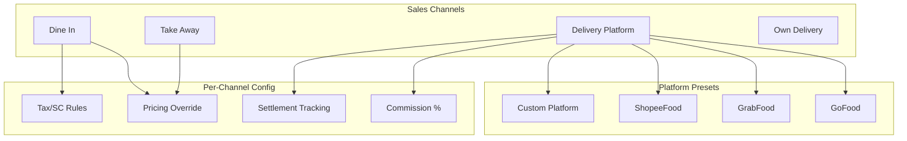

# 01 — Product Overview

> IntiKasir F&B — Android Point of Sale untuk Restoran & Kafe

---

## 1.1 Visi Produk

IntiKasir F&B adalah aplikasi PoS Android yang dirancang khusus untuk bisnis Food & Beverage di Indonesia. Dibangun dengan prinsip **offline-first**, aplikasi ini berfungsi penuh tanpa internet dan siap untuk sinkronisasi multi-device ketika dibutuhkan.

### Value Proposition

- **Offline-first**: 100% fungsional tanpa internet — cocok untuk food court, kaki lima, hingga restoran
- **Multi-channel**: Dine In, Take Away, GoFood, GrabFood, ShopeeFood — semua dengan harga berbeda
- **F&B-native**: Modifier (level pedas, ukuran), kitchen ticket, table management, recipe/COGS
- **Cloud-ready**: Sync metadata dari hari pertama — migrasi ke multi-device tanpa refactor
- **Self-hosted**: API cloud di server sendiri — tanpa vendor lock-in, kontrol penuh

## 1.2 Target Pasar

| Segmen | Deskripsi | Contoh |
|--------|-----------|--------|
| **Micro** | 1 device, 1 outlet, owner-operated | Warung kopi, food truck |
| **Small** | 1-3 device, 1 outlet, beberapa staf | Kafe, restoran kecil |
| **Medium** | Multi-device, multi-outlet | Chain restoran, franchise lokal |

## 1.3 Fitur Utama

### Core PoS Flow

### Fitur per Fase

| Fase | Fitur | Status |
|------|-------|--------|
| **1** | Setup wizard, login PIN, catalog CRUD, PoS flow, payment, receipt printing, cashier session | 73% |
| **2** | Kitchen display, customer management, inventory, discount/promo, reporting | 30% |
| **3** | Cloud sync (push-pull), background sync, online/offline transition | 0% |
| **4** | Multi-terminal, real-time sync, manager dashboard | 0% |
| **5** | Multi-outlet aggregation, multi-tenant isolation | 0% |

## 1.4 Sales Channel Support

IntiKasir mendukung multiple sales channel dengan pricing independen:

> Diagram file: [`diagrams/product-01-sales-channels.mmd`](diagrams/product-01-sales-channels.mmd)

## 1.5 User Roles

| Role | Akses | Terminal Type |
|------|-------|---------------|
| **Owner** | Semua fitur + settings + laporan | MANAGER |
| **Manager** | Operasional + laporan | MANAGER |
| **Cashier** | PoS, payment, session | CASHIER |
| **Waiter** | Order taking, table | WAITER |
| **Kitchen** | Kitchen display, ticket status | KITCHEN_DISPLAY |

## 1.6 Platform & Requirements

| Item | Spesifikasi |
|------|-------------|
| Platform | Android |
| Min SDK | 29 (Android 10) |
| Target SDK | 35 |
| Compile SDK | 36 |
| Bahasa | Kotlin 2.3.10 |
| UI | Jetpack Compose |
| Database | Room (SQLite) |
| Printer | Thermal printer via Bluetooth SPP |

## 1.7 Competitive Landscape (F&B PoS Indonesia)

| Aspek | IntiKasir | Kompetitor Umum |
|-------|-----------|-----------------|
| Offline capability | Full offline, sync optional | Umumnya butuh internet |
| Deployment | Self-hosted cloud | SaaS / vendor-hosted |
| Multi-channel pricing | Per-channel configurable | Fixed atau manual |
| Platform settlement | Built-in tracking | Manual atau tidak ada |
| Source code | Dimiliki sendiri | Vendor lock-in |
| Biaya recurring | Hanya hosting (optional) | Subscription bulanan |

---

*Dokumen terkait: [02-Architecture Overview](02-architecture-overview.md) · [04-F&B Domain](04-fnb-domain-specialization.md)*
