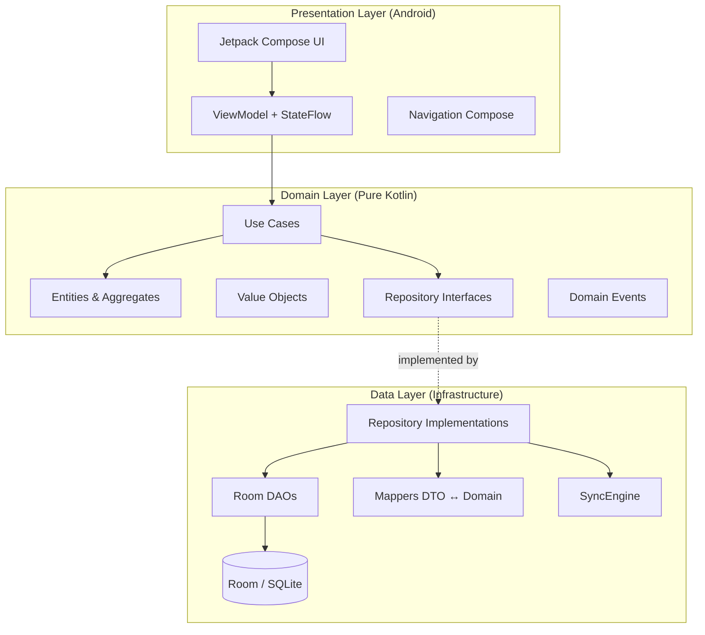
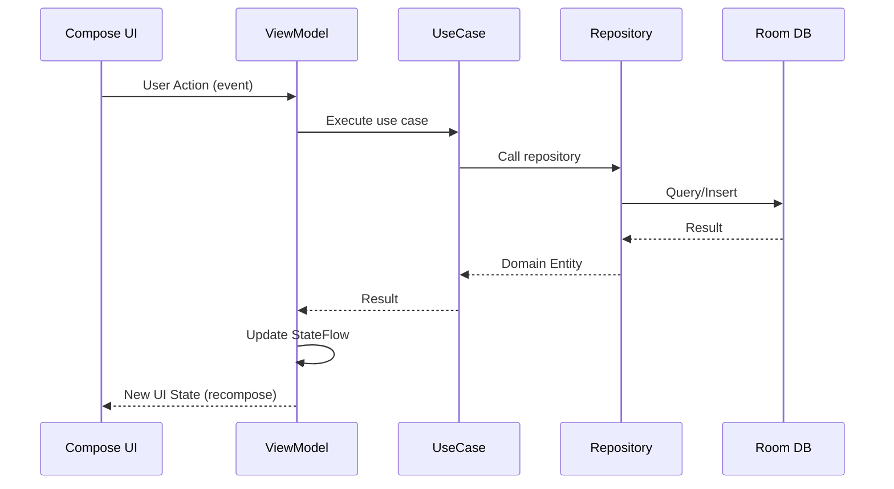
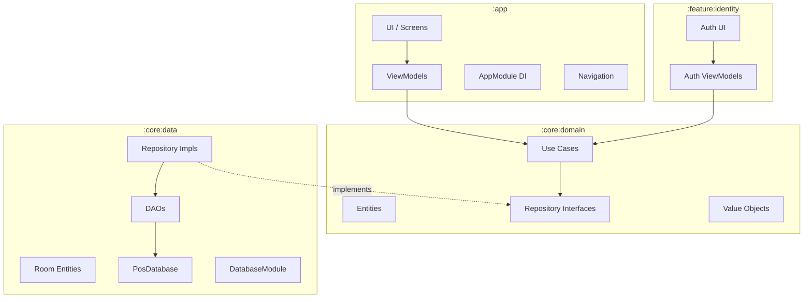

# 02 — Architecture Overview

> Clean Architecture + Domain-Driven Design + MVVM

---

## 2.1 Arsitektur Berlapis

IntiKasir mengadopsi Clean Architecture dengan 3 layer utama, dipadukan dengan DDD untuk domain modeling dan MVVM untuk presentation.



> Diagram file: [`diagrams/arch-01-clean-architecture.mmd`](diagrams/arch-01-clean-architecture.mmd)

### Dependency Rule

```
Presentation → Domain ← Data
```

- **Domain** tidak depend ke apapun (pure Kotlin stdlib)
- **Data** depend ke Domain (implements interfaces)
- **Presentation** depend ke Domain (use cases) dan Data (via DI)
- Tidak ada circular dependency

## 2.2 MVVM Pattern



> Diagram file: [`diagrams/arch-02-mvvm-flow.mmd`](diagrams/arch-02-mvvm-flow.mmd)

### State Management

| Konsep | Implementasi |
|--------|-------------|
| UI State | `data class UiState(...)` di ViewModel |
| State holder | `MutableStateFlow<UiState>` (private) |
| State exposure | `StateFlow<UiState>` (public, read-only) |
| Side effects | One-shot events via `Channel` atau `SharedFlow` |
| Lifecycle | `collectAsStateWithLifecycle()` di Compose |

## 2.3 Domain-Driven Design

### Tactical Patterns

| Pattern | Penggunaan | Contoh |
|---------|-----------|--------|
| **Entity** | Object dengan identity (ULID) | `Sale`, `MenuItem`, `User` |
| **Value Object** | Immutable, no identity | `Money`, `SyncMetadata`, `PlatformConfig` |
| **Aggregate Root** | Consistency boundary | `Sale` (owns OrderLine, Payment) |
| **Repository** | Collection-like persistence | `SaleRepository`, `MenuItemRepository` |
| **Use Case** | Application service | `CreateSaleUseCase`, `AddPaymentUseCase` |
| **Domain Event** | Cross-context communication | `OrderConfirmed`, `PaymentReceived` |
| **Factory** | Complex object creation | `SalesChannel.dineIn()`, `SalesChannel.takeAway()` |

### Strategic Patterns

| Pattern | Penggunaan |
|---------|-----------|
| **Bounded Context** | 12 domain terpisah (lihat [03-Domain Model](03-domain-model.md)) |
| **Context Map** | Relasi antar context (Conformist, ACL, Shared Kernel) |
| **Ubiquitous Language** | Istilah konsisten: Sale (bukan Order), OrderLine (bukan Item) |
| **Anti-Corruption Layer** | ProductRef di Transaction → Catalog lookup |

## 2.4 Module Architecture



> Diagram file: [`diagrams/arch-03-module-architecture.mmd`](diagrams/arch-03-module-architecture.mmd)

## 2.5 Key Architectural Decisions

| Keputusan | ADR | Rationale |
|-----------|-----|-----------|
| Offline-first with optional cloud | [ADR-001](adr/ADR-001-offline-first-architecture.md) | 100% fungsional tanpa internet |
| ULID for all entity IDs | [ADR-002](adr/ADR-002-ulid-for-entity-ids.md) | Sortable, offline-safe, no coordination |
| Single module per layer | [ADR-003](adr/ADR-003-single-module-per-layer.md) | Simplicity untuk tim kecil |
| Self-hosted cloud API | [ADR-004](adr/ADR-004-self-hosted-cloud-api.md) | No vendor lock-in |
| Push-pull sync | [ADR-005](adr/ADR-005-sync-push-pull-with-versioning.md) | Simple, proven pattern |
| Terminal as first-class entity | [ADR-006](adr/ADR-006-terminal-as-first-class-entity.md) | Multi-device ready from day 1 |
| Room as local database | [ADR-007](adr/ADR-007-room-as-local-database.md) | Android standard, good Kotlin support |

## 2.6 Cross-Cutting Concerns

| Concern | Approach |
|---------|----------|
| **Error Handling** | `Result<T>` wrapping, ViewModel catches and maps to UiState |
| **Logging** | Android `Log` (dev), structured logging (production planned) |
| **Concurrency** | Coroutines + `Dispatchers.IO` for DB, `Dispatchers.Main` for UI |
| **DI** | Hilt `@Singleton` for repositories, `@Provides` for use cases |
| **Configuration** | Settings per Tenant → per Outlet → per Terminal hierarchy |

---

*Dokumen terkait: [03-Domain Model](03-domain-model.md) · [08-Module Structure](08-module-and-project-structure.md)*
