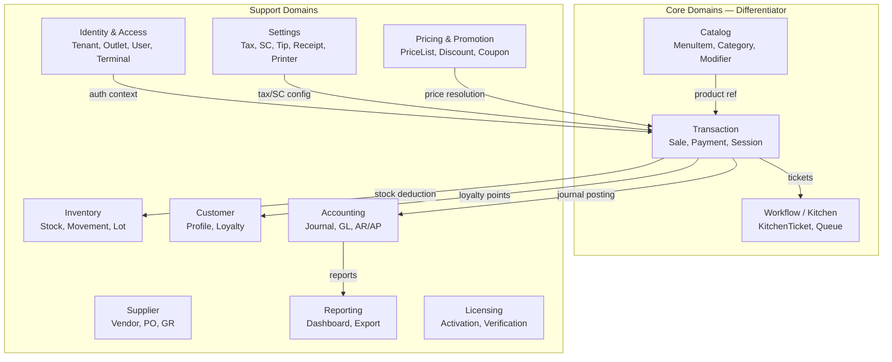
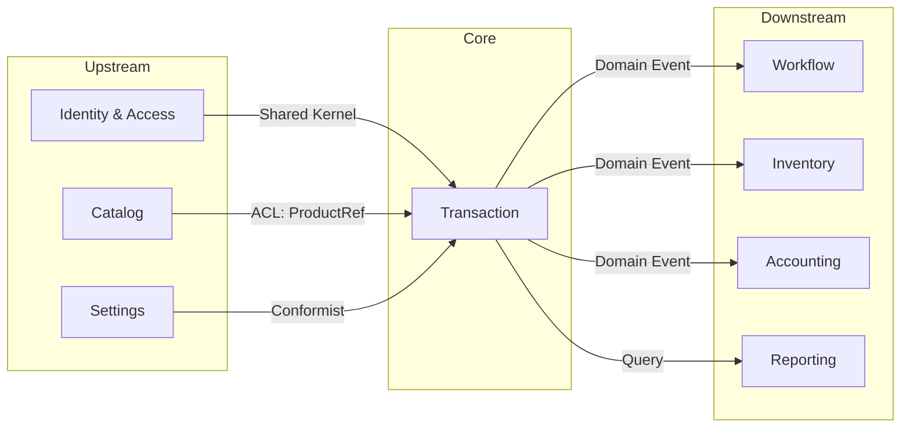
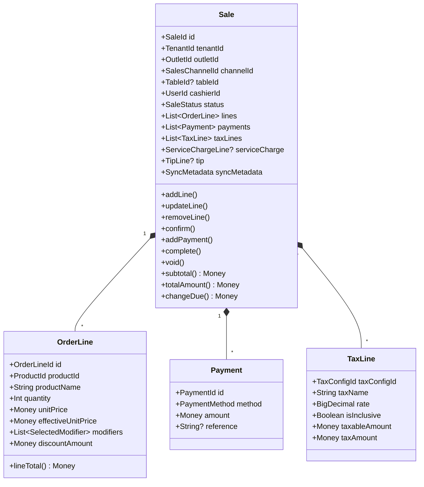
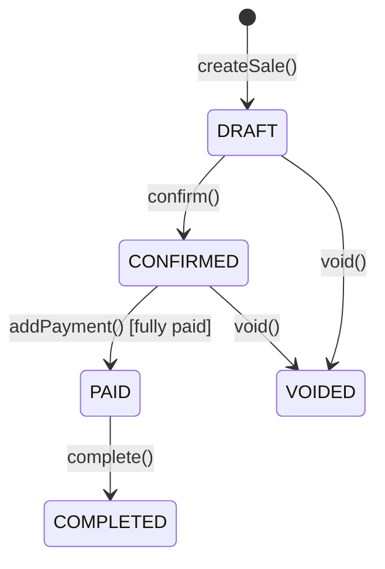
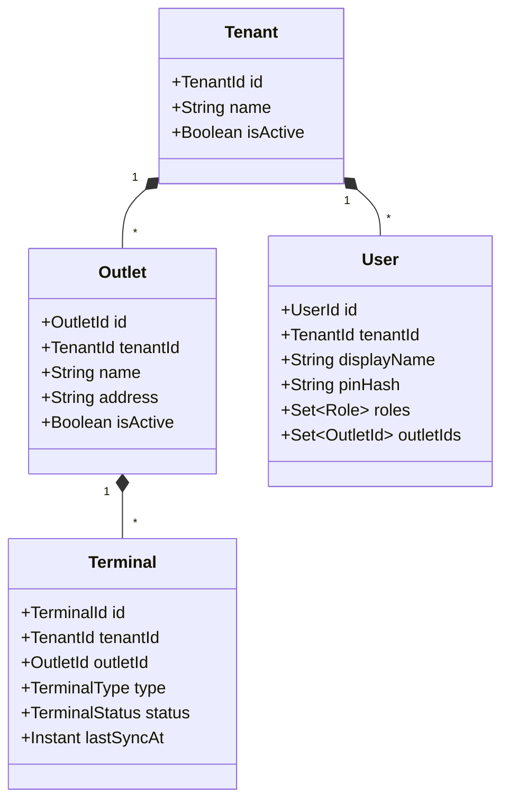

# 03 — Domain Model

> Bounded Contexts, Entities, Value Objects, dan Aggregates

---

## 3.1 Domain Classification

IntiKasir memiliki 12 bounded context yang dikategorikan menjadi Core dan Support domain.



> Diagram file: [`diagrams/domain-01-classification.mmd`](diagrams/domain-01-classification.mmd)

## 3.2 Context Map



> Diagram file: [`diagrams/domain-02-context-map.mmd`](diagrams/domain-02-context-map.mmd)

### Relasi Antar Context

| Upstream | Downstream | Pattern | Deskripsi |
|----------|------------|---------|-----------|
| Identity | Transaction | Shared Kernel | TenantId, OutletId, UserId shared |
| Catalog | Transaction | ACL (ProductRef) | OrderLine menyimpan snapshot, bukan reference langsung |
| Settings | Transaction | Conformist | Tax/SC config di-apply saat confirm |
| Transaction | Workflow | Domain Event | `OrderConfirmed` → create KitchenTicket |
| Transaction | Inventory | Domain Event | `SaleCompleted` → deduct stock |
| Transaction | Accounting | Domain Event | `PaymentReceived` → post journal |

## 3.3 Transaction Context (Core)

### Aggregate: Sale



> Diagram file: [`diagrams/domain-03-sale-aggregate.mmd`](diagrams/domain-03-sale-aggregate.mmd)

### State Machine: Sale



> Diagram file: [`diagrams/domain-04-sale-state-machine.mmd`](diagrams/domain-04-sale-state-machine.mmd)

### Value Objects

| Value Object | Fields | Deskripsi |
|-------------|--------|-----------|
| `Money` | `currency: String, amount: BigDecimal` | Aritmetika aman untuk uang |
| `SaleId` | `value: String` (ULID) | Identity Sale |
| `OrderLineId` | `value: String` (ULID) | Identity OrderLine |
| `PaymentId` | `value: String` (ULID) | Identity Payment |
| `SelectedModifier` | `name, priceDelta` | Snapshot modifier di order |
| `ProductRef` | `productId, name, price` | ACL snapshot dari Catalog |
| `PaymentBreakdown` | `entries: List<Entry>` | Summary pembayaran multi-method |

### Enums

| Enum | Values |
|------|--------|
| `SaleStatus` | `DRAFT, CONFIRMED, PAID, COMPLETED, VOIDED` |
| `PaymentMethod` | `CASH, CARD, E_WALLET, TRANSFER, OTHER` |

## 3.4 Catalog Context (Core)

| Entity/VO | Tipe | Fields Utama |
|-----------|------|-------------|
| `MenuItem` | Entity | id, tenantId, categoryId, name, basePrice, imageUri, isActive |
| `Category` | Entity | id, tenantId, name, parentId, sortOrder, isActive |
| `ModifierGroup` | Entity | id, tenantId, name, isActive |
| `ModifierOption` | Entity | id, groupId, name, priceDelta, isActive |
| `MenuItemModifierLink` | Junction | menuItemId, modifierGroupId, isRequired, min/maxSelection |
| `PriceList` | Entity | id, tenantId, name, channelId |
| `PriceListEntry` | Entity | id, priceListId, menuItemId, overridePrice |

## 3.5 Identity & Access Context (Support)



> Diagram file: [`diagrams/domain-05-identity-context.mmd`](diagrams/domain-05-identity-context.mmd)

### Terminal Types

| Type | Fungsi | Fitur |
|------|--------|-------|
| `CASHIER` | Kasir utama | PoS, payment, receipt print |
| `WAITER` | Pelayan | Order taking, table assignment |
| `KITCHEN_DISPLAY` | Dapur | Kitchen ticket display |
| `MANAGER` | Manajer | Reports, settings, override |

## 3.6 Settings Context (Support)

| Entity/VO | Scope | Fields Utama |
|-----------|-------|-------------|
| `TenantSettings` | Per Tenant | currencyCode, numberingConfig, syncEnabled |
| `OutletSettings` | Per Outlet | timezone, serviceCharge, tip, receiptConfig |
| `TerminalSettings` | Per Terminal | printerConfig |
| `TaxConfig` | Per Tenant | name, rate, isInclusive, scope, isActive |
| `ReceiptConfig` | Per Outlet | header (logo, name, NPWP), body (toggles), footer |
| `PrinterConfig` | Per Terminal | connectionType, address, autoCut, autoPrint |

## 3.7 Workflow Context (Core)

| Entity | Fields Utama | Status |
|--------|-------------|--------|
| `KitchenTicket` | id, saleId, items, status, createdAt | Domain DONE, UI NOT_STARTED |
| `KitchenTicketItem` | menuItemName, quantity, modifiers, notes | Domain DONE |

### Kitchen Ticket Status Flow

```
PENDING → IN_PROGRESS → READY → SERVED
                      → CANCELLED
```

## 3.8 Other Contexts (Support)

| Context | Entities | Data Layer | UI | Overall |
|---------|----------|------------|-----|---------|
| **Customer** | Customer, Address | DONE | NOT_STARTED | PARTIAL |
| **Inventory** | StockLevel, StockMovement | NOT_STARTED | NOT_STARTED | PARTIAL |
| **Supplier** | Supplier, PurchaseOrder | NOT_STARTED | NOT_STARTED | PARTIAL |
| **Accounting** | Journal, JournalEntry, Account | NOT_STARTED | NOT_STARTED | PARTIAL |
| **Reporting** | — | NOT_STARTED | NOT_STARTED | NOT_STARTED |
| **Licensing** | License, Activation | NOT_STARTED | NOT_STARTED | NOT_STARTED |

## 3.9 Shared Kernel

Value objects dan interfaces yang digunakan lintas bounded context:

| Item | Package | Deskripsi |
|------|---------|-----------|
| `Money` | `domain.shared` | Currency + BigDecimal |
| `SyncMetadata` | `domain.shared` | syncStatus, syncVersion, timestamps, terminalIds |
| `SyncStatus` | `domain.shared` | PENDING, SYNCED, CONFLICT |
| `Syncable` | `domain.shared` | Interface marker untuk entity syncable |
| `SyncEngine` | `domain.sync` | Interface: notifyChange, syncNow, observeStatus |
| ID Value Classes | `domain.*.XxxId` | Type-safe ULID wrappers |
| `UlidGenerator` | `domain.shared` | ULID generation utility |

---

*Dokumen terkait: [04-F&B Specialization](04-fnb-domain-specialization.md) · [05-Data Architecture](05-data-architecture.md) · [09-Use Case Reference](09-use-case-reference.md)*
