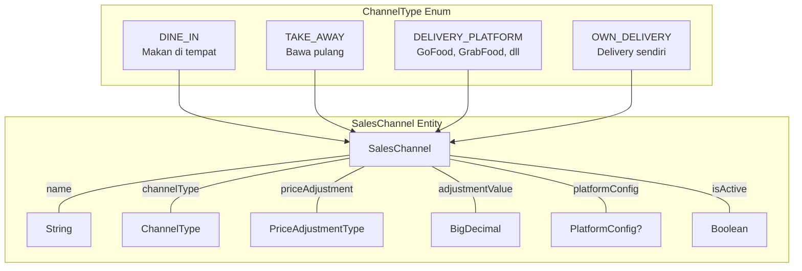
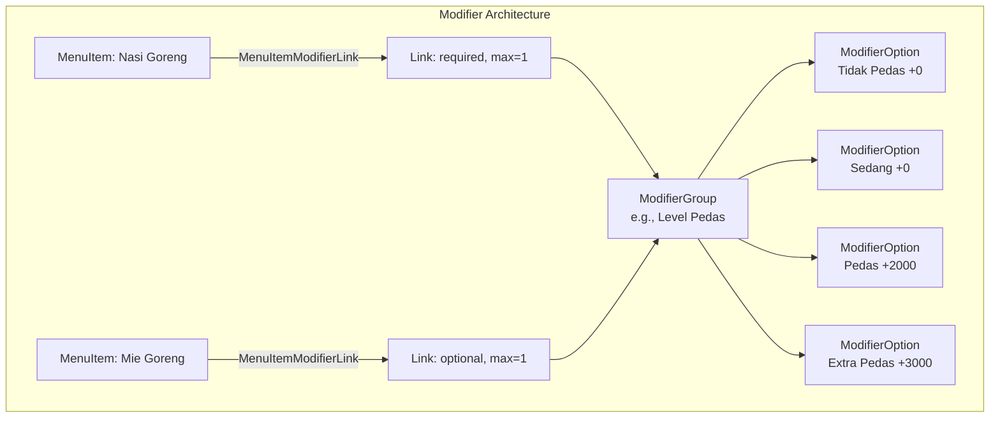
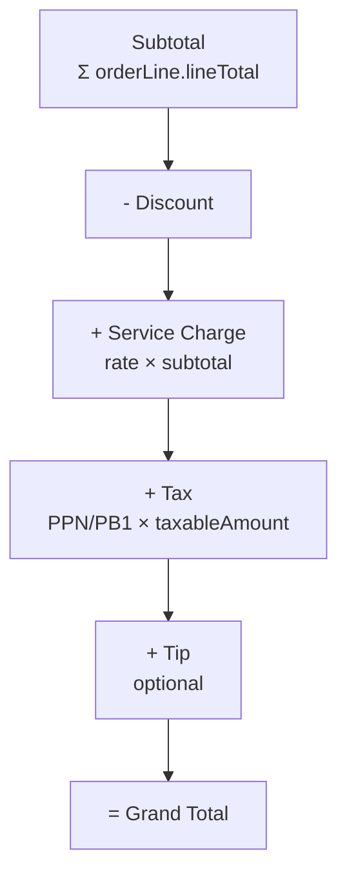
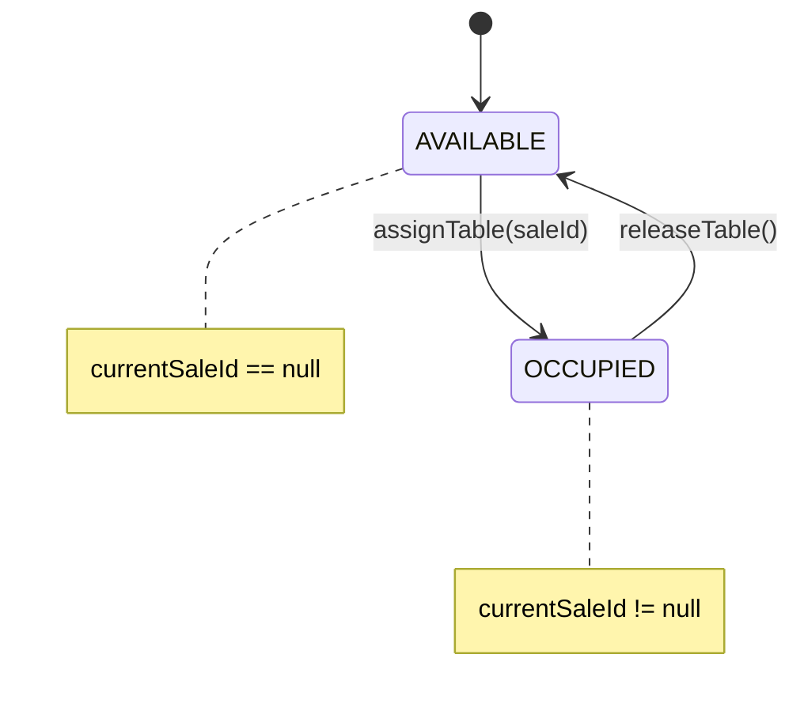
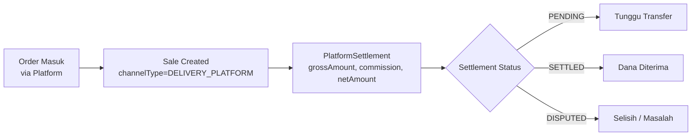
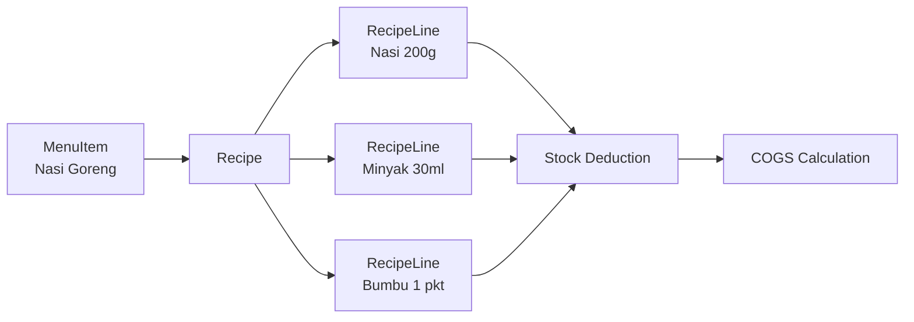

# 04 — F&B Domain Specialization

> Fitur khusus Food & Beverage: channels, modifiers, recipe/COGS, tax/SC/tip, platform delivery

---

## 4.1 Sales Channel Architecture

F&B memiliki kebutuhan multi-channel yang unik — harga Dine In bisa berbeda dengan GoFood, service charge hanya untuk Dine In, commission tracking untuk platform delivery.

### Channel Types



> Diagram file: [`diagrams/fnb-01-channel-architecture.mmd`](diagrams/fnb-01-channel-architecture.mmd)

### Price Resolution

Setiap channel dapat memiliki harga berbeda melalui 4 mekanisme:

| PriceAdjustmentType | Contoh | Formula |
|---------------------|--------|---------|
| `NONE` | Harga sama | `basePrice` |
| `MARKUP_PERCENT` | GoFood +20% | `basePrice * (1 + rate)` |
| `MARKUP_FIXED` | Take Away +2000 | `basePrice + amount` |
| `DISCOUNT_PERCENT` | Dine In -10% | `basePrice * (1 - rate)` |
| `DISCOUNT_FIXED` | Promo -5000 | `basePrice - amount` |

Selain itu, `PriceList` dapat override harga per-item per-channel.

**Priority**: PriceList override > Channel adjustment > Base price

### Platform Config (Delivery Platform)

```kotlin
data class PlatformConfig(
    val platformName: String,          // "GoFood", "GrabFood", "ShopeeFood"
    val commissionPercent: BigDecimal,  // e.g., 20%
    val requiresExternalOrderId: Boolean,
    val autoConfirmOrder: Boolean,
    val paymentMethod: PaymentMethod    // Platform-specific default
)
```

## 4.2 Modifier System

F&B modifier berbeda dari retail variant — modifier bersifat reusable lintas menu item.



> Diagram file: [`diagrams/fnb-02-modifier-system.mmd`](diagrams/fnb-02-modifier-system.mmd)

### Modifier di Order (Snapshot Pattern)

Saat item ditambahkan ke order, modifier di-snapshot sebagai `SelectedModifier`:

```kotlin
data class SelectedModifier(
    val name: String,        // "Extra Pedas"
    val priceDelta: Money    // +3000
)

// OrderLine.lineTotal = (unitPrice + modifierTotal) * quantity - discount
```

Ini memastikan perubahan modifier group di catalog tidak mengubah transaksi yang sudah ada.

## 4.3 Tax, Service Charge & Tip

### Calculation Order



> Diagram file: [`diagrams/fnb-03-calculation-order.mmd`](diagrams/fnb-03-calculation-order.mmd)

### Tax Config

| Field | Deskripsi | Contoh |
|-------|-----------|--------|
| `name` | Nama pajak | "PPN", "PB1" |
| `rate` | Persentase | 0.11 (11%) |
| `isInclusive` | Termasuk harga? | true = harga sudah include pajak |
| `scope` | Cakupan | ALL_ITEMS, SPECIFIC_CATEGORIES, SPECIFIC_ITEMS |
| `applicableIds` | Item/category IDs | Untuk scope SPECIFIC_* |

**Multiple tax support**: Bisa aktifkan PPN + PB1 secara bersamaan.

### Service Charge Config

| Field | Deskripsi | Contoh |
|-------|-----------|--------|
| `rate` | Persentase | 0.05 (5%) |
| `isEnabled` | Aktif? | true |
| `applicableChannelTypes` | Channel mana saja | `[DINE_IN]` — hanya makan di tempat |
| `isIncludedInPrice` | Termasuk harga? | false |

### Tip Config

| Field | Deskripsi | Contoh |
|-------|-----------|--------|
| `isEnabled` | Aktif? | true |
| `suggestedPercentages` | Saran persentase | `[5, 10, 15]` |
| `allowCustomAmount` | Bebas input? | true |
| `applicableChannelTypes` | Channel | `[DINE_IN, TAKE_AWAY]` |

### Kapan Dihitung?

Tax dan SC dihitung **saat confirm order** (DRAFT → CONFIRMED) dan di-freeze sebagai `TaxLine` / `ServiceChargeLine` pada Sale. Ini memastikan:
- Perubahan settings setelah confirm tidak mengubah transaksi
- Audit trail yang akurat
- Konsistensi dengan struk yang sudah dicetak

## 4.4 Table Management (Dine In)



> Diagram file: [`diagrams/fnb-04-table-state.mmd`](diagrams/fnb-04-table-state.mmd)

Table status diturunkan (derived) dari `currentSaleId`:
- `currentSaleId == null` → AVAILABLE
- `currentSaleId != null` → OCCUPIED

## 4.5 Platform Settlement

Untuk delivery platform (GoFood, GrabFood, dll.), perlu tracking settlement:



> Diagram file: [`diagrams/fnb-05-platform-settlement.mmd`](diagrams/fnb-05-platform-settlement.mmd)

| Field | Deskripsi |
|-------|-----------|
| `grossAmount` | Total yang dibayar customer ke platform |
| `commissionAmount` | Potongan komisi platform |
| `netAmount` | Yang diterima merchant |
| `settlementStatus` | PENDING → SETTLED / DISPUTED / CANCELLED |

## 4.6 Split Bill

Mendukung 3 strategi split bill:

| Strategy | Deskripsi | Contoh |
|----------|-----------|--------|
| `EQUAL` | Bagi rata | 4 orang, total 100K → @25K |
| `BY_ITEM` | Per item yang dipesan | A bayar nasi goreng, B bayar mie goreng |
| `BY_AMOUNT` | Nominal custom | A bayar 60K, B bayar 40K |

## 4.7 Recipe & COGS (Planned)



> Diagram file: [`diagrams/fnb-06-recipe-cogs.mmd`](diagrams/fnb-06-recipe-cogs.mmd)

**Status**: Domain model ada (`Recipe`, `RecipeLine`), belum terintegrasi dengan Inventory dan Accounting.

---

*Dokumen terkait: [03-Domain Model](03-domain-model.md) · [05-Data Architecture](05-data-architecture.md)*
