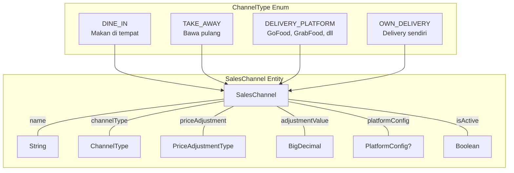
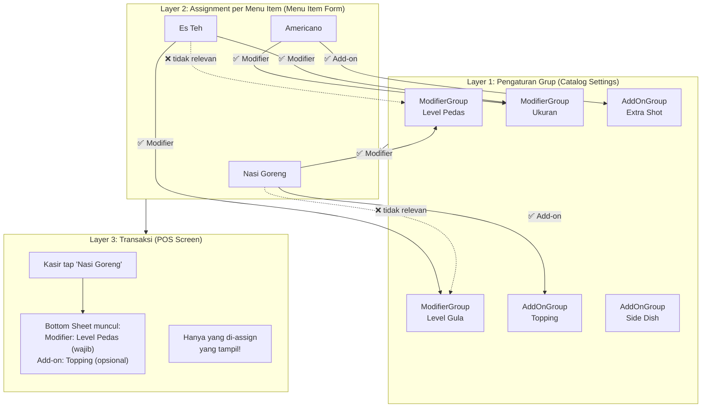
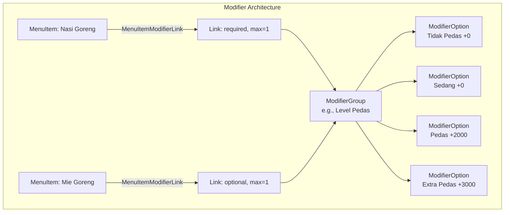
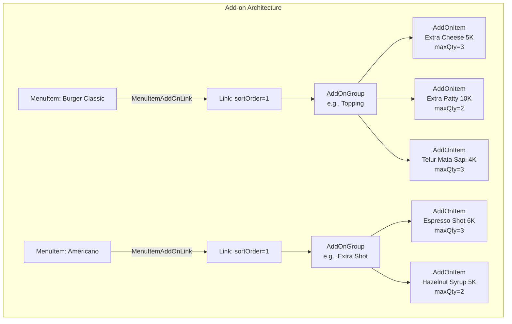
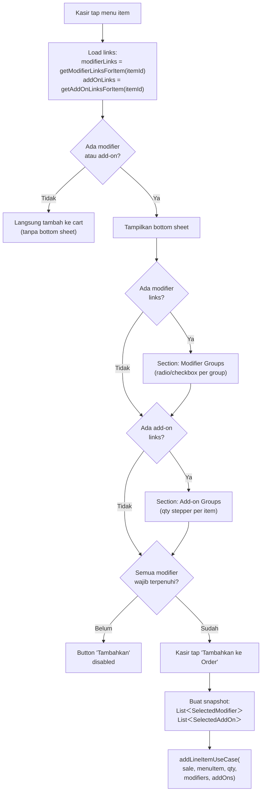
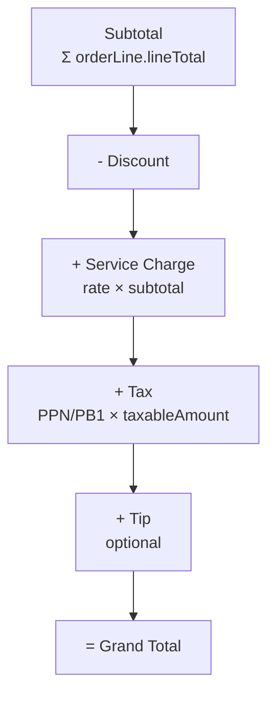
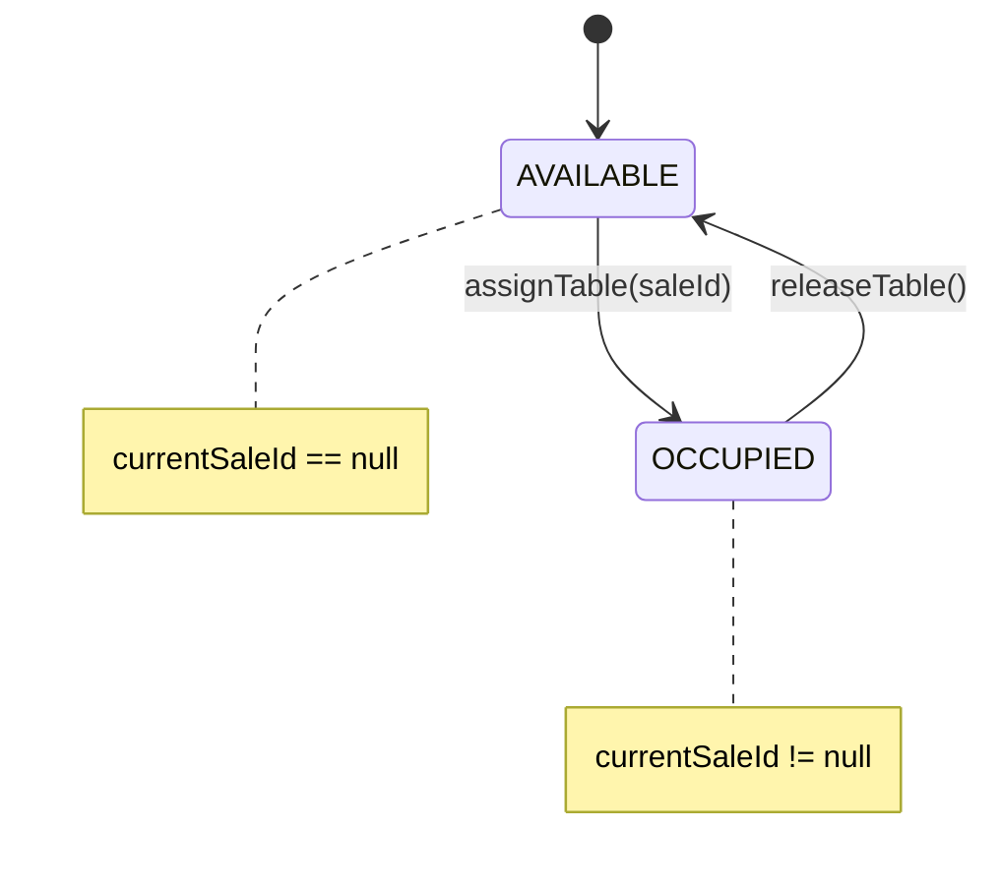
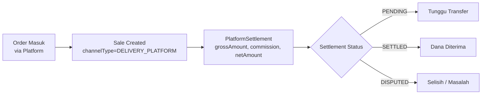
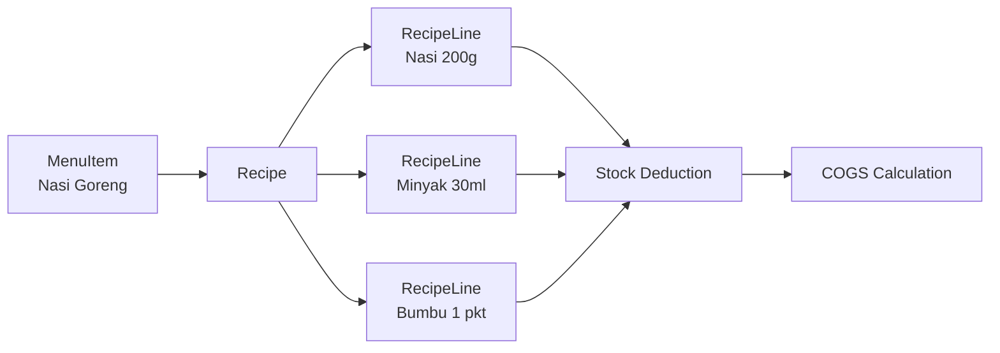

# 04 — F&B Domain Specialization

> Fitur khusus Food & Beverage: channels, modifiers, recipe/COGS, tax/SC/tip, platform delivery

---

## 4.1 Sales Channel Architecture

F&B memiliki kebutuhan multi-channel yang unik — harga Dine In bisa berbeda dengan GoFood, service charge hanya untuk Dine In, commission tracking untuk platform delivery.

### Channel Types



> Diagram file: [`diagrams/fnb-01-channel-architecture.mmd`](diagrams/fnb-01-channel-architecture.mmd)

### Price Resolution

Setiap channel dapat memiliki harga berbeda melalui 4 mekanisme:

| PriceAdjustmentType | Contoh | Formula |
|---------------------|--------|---------|
| `NONE` | Harga sama | `basePrice` |
| `MARKUP_PERCENT` | GoFood +20% | `basePrice * (1 + rate)` |
| `MARKUP_FIXED` | Take Away +2000 | `basePrice + amount` |
| `DISCOUNT_PERCENT` | Dine In -10% | `basePrice * (1 - rate)` |
| `DISCOUNT_FIXED` | Promo -5000 | `basePrice - amount` |

Selain itu, `PriceList` dapat override harga per-item per-channel.

**Priority**: PriceList override > Channel adjustment > Base price

### Platform Config (Delivery Platform)

```kotlin
data class PlatformConfig(
    val platformName: String,          // "GoFood", "GrabFood", "ShopeeFood"
    val commissionPercent: BigDecimal,  // e.g., 20%
    val requiresExternalOrderId: Boolean,
    val autoConfirmOrder: Boolean,
    val paymentMethod: PaymentMethod    // Platform-specific default
)
```

## 4.2 Modifier & Add-on System

F&B memiliki dua mekanisme kustomisasi yang berbeda: **Modifier** dan **Add-on**. Keduanya bersifat **reusable** (satu grup bisa di-assign ke banyak menu item) dan **per-item assignment** (setiap menu item memilih sendiri grup mana yang relevan).

### Mengapa Perlu Dua Mekanisme?

Contoh kesalahan tanpa assignment per-item:
- ❌ Es Teh muncul pilihan "Level Pedas"
- ❌ Nasi Goreng muncul add-on "Less Sugar"
- ❌ Semua item muncul semua modifier/add-on → membingungkan kasir

Solusi: **3-Layer Architecture** — Buat grup → Assign ke menu item → Tampil di transaksi.

### Modifier vs Add-on — Perbedaan Konsep

| Aspek | Modifier | Add-on |
|-------|----------|--------|
| **Tujuan** | Kustomisasi cara penyajian item | Item tambahan di atas base item |
| **Contoh** | Level Pedas, Level Gula, Ukuran, Matang/Medium/Rare | Extra Cheese, Extra Shot Espresso, Topping Boba, Extra Patty |
| **Harga** | Bisa gratis (preferensi) atau ada delta harga | Selalu ada harga sendiri |
| **Pemilihan** | Selection-based (pilih 1 atau N dari group) | Quantity-based (1x, 2x, 3x Extra Cheese) |
| **Inventory** | Umumnya tidak track inventory | Bisa track inventory (deduct stock per qty) |
| **Display di struk** | Berbayar: `+ Large  5.000`, Gratis: `(Extra Pedas)` | `+ Extra Cheese  5.000` (qty 1), `+ Keju 2x3.000  6.000` (qty >1) |
| **Pricing** | `priceDelta` (bisa 0, bisa + atau -) | `price` per unit × quantity |
| **Selection rules** | Di **ModifierGroup**: isRequired, minSelection, maxSelection | Di **AddOnItem**: maxQty per item |
| **Link config** | sortOrder saja (simple toggle) | sortOrder saja |

### 3-Layer Architecture (Best Practice Modern F&B PoS)



> Diagram file: [`diagrams/fnb-08-modifier-addon-assignment-flow.mmd`](diagrams/fnb-08-modifier-addon-assignment-flow.mmd)

### Layer 1: Pengaturan Grup (Catalog Settings)

Grup modifier dan add-on dibuat secara independen — belum terikat ke menu item manapun. Ini adalah **reusable pool**.

**UI**: Catalog → tab "Modifier" dan tab "Add-on" (masing-masing CRUD screen).

```
Modifier Groups:                        Add-on Groups:
┌──────────────────────────────┐       ┌────────────────────────┐
│ Level Pedas                   │       │ Topping                │
│  Pilih 1 · Wajib              │       │  • Extra Cheese   Rp5K │
│  • Tidak Pedas    +0         │       │  • Extra Patty   Rp10K │
│  • Sedang         +0         │       │  • Telur Mata    Rp4K  │
│  • Pedas       +2.000        │       │  maxQty: 3 per item    │
│  • Extra Pedas +3.000        │       ├────────────────────────┤
├──────────────────────────────┤       │ Extra Shot             │
│ Level Gula                    │       │  • Espresso Shot  Rp6K │
│  Pilih 1 · Wajib              │       │  • Hazelnut Syrup Rp5K │
│  • Normal         +0         │       │  maxQty: 3 per item    │
│  • Less Sugar     +0         │       ├────────────────────────┤
│  • No Sugar       +0         │       │ Side Dish              │
├──────────────────────────────┤       │  • Kentang Goreng Rp8K │
│ Ukuran                        │       │  • Onion Ring    Rp10K │
│  Pilih 1 · Wajib              │       │  maxQty: 2 per item    │
│  • Regular        +0         │       └────────────────────────┘
│  • Large       +5.000        │
│  • Extra Large +8.000        │
└──────────────────────────────┘
```

> Selection rules (Pilih 1/Pilih Beberapa, Wajib/Opsional) didefinisikan di level **ModifierGroup** saat pembuatan group. Tidak perlu dikonfigurasi ulang saat attach ke menu item.

### Layer 2: Assignment per Menu Item (Menu Item Form)

Di form edit/tambah menu item, pemilik usaha memilih grup mana yang berlaku. Ini yang **mencegah "Es Teh + Level Pedas"**.

**UI**: Menu Item Form → section "Modifier" (checklist + config) dan section "Add-on" (checklist).

```
┌──────────────────────────────────────────────────────────┐
│  Edit Menu Item: Nasi Goreng Special                     │
│                                                          │
│  [Nama] [Kategori] [Harga] [Gambar] ...                  │
│                                                          │
│  ── Modifier ──────────────────────────────────────────  │
│  ☑ Level Pedas     4 opsi · Pilih 1 · Wajib              │
│  ☐ Level Gula      ← tidak dicentang = tidak muncul      │
│  ☑ Ukuran          3 opsi · Pilih 1 · Wajib              │
│                                                          │
│  ── Add-on ────────────────────────────────────────────  │
│  ☑ Topping             ← centang = muncul saat order     │
│  ☐ Extra Shot          ← tidak relevan untuk nasi goreng │
│  ☑ Side Dish                                             │
│                                                          │
│                                        [Simpan]          │
└──────────────────────────────────────────────────────────┘
```

> **Catatan arsitektur**: Selection rules (isRequired, minSelection, maxSelection) ada di **ModifierGroup**, bukan di link. Saat attach ke menu item, cukup checkbox on/off. Info aturan ditampilkan read-only dari group (misal "4 opsi · Pilih 1 · Wajib"). Ini mengikuti best practice F&B PoS (Square, Toast, Lightspeed) — sifat "pilih satu" atau "pilih beberapa" melekat pada nature group-nya, bukan pada menu item yang dipasangi.

**Aturan assignment:**

| Aspek | Modifier Link | Add-on Link |
|-------|---------------|-------------|
| **Junction entity** | `MenuItemModifierLink` | `MenuItemAddOnLink` |
| **Config per-link** | sortOrder saja (simple toggle) | sortOrder saja |
| **Selection rules** | Di **ModifierGroup**: isRequired, minSelection, maxSelection | Di **AddOnItem**: maxQty |
| **Relasi** | M:N (1 group → many items, 1 item → many groups) | M:N (sama) |
| **UX saat attach** | Checkbox on/off, info rule read-only dari group | Checkbox on/off |

### Layer 3: Transaksi (POS Screen)

Saat kasir tap menu item, sistem:
1. Load `MenuItemModifierLink` untuk item tersebut → ambil ModifierGroup yang di-assign
2. Load `MenuItemAddOnLink` untuk item tersebut → ambil AddOnGroup yang di-assign
3. **Jika ada link**: tampilkan bottom sheet dengan modifier + add-on
4. **Jika tidak ada link**: langsung tambahkan ke cart

```
┌──────────────────────────────────────────────────┐
│  Nasi Goreng Special                    Rp25.000 │
│                                                  │
│  ── Modifier ─────────────────────────────────── │
│  Level Pedas (Wajib · Pilih 1)                   │
│  ┌──────────┐┌──────────┐┌──────────┐┌─────────┐│
│  │○ Tdk Pdas││○ Sedang  ││● Pedas   ││○ Extra  ││
│  │   +0     ││   +0     ││  +2.000  ││  +3.000 ││
│  └──────────┘└──────────┘└──────────┘└─────────┘│
│                                                  │
│  Ukuran (Wajib · Pilih 1)                        │
│  ┌──────────┐┌──────────┐┌──────────┐           │
│  │● Regular ││○ Large   ││○ XL      │           │
│  │   +0     ││  +5.000  ││  +8.000  │           │
│  └──────────┘└──────────┘└──────────┘           │
│                                                  │
│  ── Add-on ───────────────────────────────────── │
│  Topping                                         │
│  Extra Cheese   Rp5.000       [ - ]  1  [ + ]   │
│  Extra Patty   Rp10.000       [ - ]  0  [ + ]   │
│  Telur Mata     Rp4.000       [ - ]  0  [ + ]   │
│                                                  │
│  Side Dish                                       │
│  Kentang Goreng  Rp8.000      [ - ]  0  [ + ]   │
│  Onion Ring     Rp10.000      [ - ]  0  [ + ]   │
│                                                  │
│  ─────────────────────────────────────────────── │
│  Harga menu:     Rp25.000                        │
│  Modifier:       +Rp2.000 (Pedas)                │
│  Add-on:         +Rp5.000 (Extra Cheese x1)      │
│  Total:          Rp32.000                        │
│                                                  │
│            [ Tambahkan ke Order ]                 │
└──────────────────────────────────────────────────┘
```

### Modifier Architecture (Domain)



> Diagram file: [`diagrams/fnb-02-modifier-system.mmd`](diagrams/fnb-02-modifier-system.mmd)

### Add-on Architecture (Domain)



> Diagram file: [`diagrams/fnb-07-addon-system.mmd`](diagrams/fnb-07-addon-system.mmd)

### Domain Models

```kotlin
// ─── Modifier (selection-based) ────────────────────────

data class ModifierGroup(
    val id: ModifierGroupId,
    val tenantId: TenantId,
    val name: String,              // e.g., "Level Pedas"
    val options: List<ModifierOption>,
    val sortOrder: Int,
    val isActive: Boolean
)

data class ModifierOption(
    val id: ModifierOptionId,
    val groupId: ModifierGroupId,
    val name: String,              // e.g., "Extra Pedas"
    val priceDelta: Money,         // bisa 0 (preferensi saja) atau +N
    val sortOrder: Int,
    val isActive: Boolean
)

// Junction: MenuItem ↔ ModifierGroup (M:N) — config per-link
data class MenuItemModifierLink(
    val id: String,
    val menuItemId: ProductId,
    val modifierGroupId: ModifierGroupId,
    val sortOrder: Int,
    val isRequired: Boolean,       // Wajib dipilih?
    val minSelection: Int,         // Min opsi yang harus dipilih
    val maxSelection: Int          // Max opsi yang boleh dipilih (1 = single, >1 = multi)
)

// ─── Add-on (quantity-based) ───────────────────────────

data class AddOnGroup(
    val id: AddOnGroupId,
    val tenantId: TenantId,
    val name: String,              // e.g., "Topping", "Extra Shot"
    val items: List<AddOnItem>,
    val sortOrder: Int,
    val isActive: Boolean
)

data class AddOnItem(
    val id: AddOnItemId,
    val groupId: AddOnGroupId,
    val name: String,              // e.g., "Extra Cheese"
    val price: Money,              // e.g., Rp5.000 (selalu positif)
    val maxQty: Int = 5,           // Batas qty per order line (0 = unlimited)
    val inventoryItemId: String?,  // Optional: link ke inventory
    val sortOrder: Int,
    val isActive: Boolean
)

// Junction: MenuItem ↔ AddOnGroup (M:N) — simple link
data class MenuItemAddOnLink(
    val id: String,
    val menuItemId: ProductId,
    val addOnGroupId: AddOnGroupId,
    val sortOrder: Int             // Urutan tampil add-on group per item
)
```

### Modifier & Add-on di Order (Snapshot Pattern)

Saat item ditambahkan ke order, modifier dan add-on di-snapshot secara terpisah:

```kotlin
// Modifier snapshot — selection-based
data class SelectedModifier(
    val groupName: String,        // "Level Pedas"
    val optionName: String,       // "Extra Pedas"
    val priceDelta: Money         // +3000
)

// Add-on snapshot — quantity-based
data class SelectedAddOn(
    val addOnName: String,        // "Extra Cheese"
    val quantity: Int,            // 2
    val unitPrice: Money,         // 5000
    val totalPrice: Money         // 10000 (unitPrice × quantity)
)

// OrderLine price calculation:
// effectiveUnitPrice = unitPrice + modifierTotal
// lineTotal = (effectiveUnitPrice * quantity) + addOnTotal - discount
//
// Catatan: addOnTotal TIDAK dikalikan quantity OrderLine karena
// add-on dipilih per-line (bukan per-unit). Misalnya:
// - 2x Burger Classic + 1x Extra Cheese → addOn = 1×5K, bukan 2×5K
// - Jika ingin 2x Extra Cheese → set addOn qty = 2
```

**Kenapa addOnTotal tidak dikali quantity OrderLine?**

Ini mengikuti best practice PoS modern (Square, Toast, Lightspeed):
- Add-on dipilih **per baris pesanan**, bukan per unit
- Kasir/pelayan secara eksplisit menentukan qty add-on saat order
- Lebih fleksibel: "3 Burger, 2 tambah keju" → qty burger=3, addOn keju qty=2

Snapshot pattern memastikan perubahan catalog (harga, nama) tidak mengubah transaksi yang sudah ada.

### POS Flow — Decision Logic



### Contoh Assignment yang Benar

| Menu Item | Modifier Groups | Add-on Groups | Alasan |
|-----------|----------------|---------------|--------|
| Nasi Goreng | Level Pedas (wajib), Ukuran | Topping, Side Dish | Makanan: pedas relevan, gula tidak |
| Es Teh Manis | Level Gula (wajib), Ukuran (wajib) | — | Minuman manis: gula relevan, pedas tidak |
| Americano | Ukuran (wajib) | Extra Shot | Kopi: shot relevan, topping tidak |
| Burger Classic | Matang/Rare (wajib) | Topping | Burger: matang relevan, gula tidak |
| Kentang Goreng | — | Saus (Sambal, Mayo, BBQ) | Snack: tidak perlu modifier, add-on saus |
| Air Mineral | — | — | Tidak ada kustomisasi → langsung ke cart |

## 4.3 Tax, Service Charge & Tip

### Calculation Order



> Diagram file: [`diagrams/fnb-03-calculation-order.mmd`](diagrams/fnb-03-calculation-order.mmd)

### Tax Config

| Field | Deskripsi | Contoh |
|-------|-----------|--------|
| `name` | Nama pajak | "PPN", "PB1" |
| `rate` | Persentase | 0.11 (11%) |
| `isInclusive` | Termasuk harga? | true = harga sudah include pajak |
| `scope` | Cakupan | ALL_ITEMS, SPECIFIC_CATEGORIES, SPECIFIC_ITEMS |
| `applicableIds` | Item/category IDs | Untuk scope SPECIFIC_* |

**Multiple tax support**: Bisa aktifkan PPN + PB1 secara bersamaan.

### Service Charge Config

| Field | Deskripsi | Contoh |
|-------|-----------|--------|
| `rate` | Persentase | 0.05 (5%) |
| `isEnabled` | Aktif? | true |
| `applicableChannelTypes` | Channel mana saja | `[DINE_IN]` — hanya makan di tempat |
| `isIncludedInPrice` | Termasuk harga? | false |

### Tip Config

| Field | Deskripsi | Contoh |
|-------|-----------|--------|
| `isEnabled` | Aktif? | true |
| `suggestedPercentages` | Saran persentase | `[5, 10, 15]` |
| `allowCustomAmount` | Bebas input? | true |
| `applicableChannelTypes` | Channel | `[DINE_IN, TAKE_AWAY]` |

### Kapan Dihitung?

Tax dan SC dihitung **saat confirm order** (DRAFT → CONFIRMED) dan di-freeze sebagai `TaxLine` / `ServiceChargeLine` pada Sale. Ini memastikan:
- Perubahan settings setelah confirm tidak mengubah transaksi
- Audit trail yang akurat
- Konsistensi dengan struk yang sudah dicetak

## 4.4 Table Management (Dine In)



> Diagram file: [`diagrams/fnb-04-table-state.mmd`](diagrams/fnb-04-table-state.mmd)

Table status diturunkan (derived) dari `currentSaleId`:
- `currentSaleId == null` → AVAILABLE
- `currentSaleId != null` → OCCUPIED

## 4.5 Platform Settlement

Untuk delivery platform (GoFood, GrabFood, dll.), perlu tracking settlement:



> Diagram file: [`diagrams/fnb-05-platform-settlement.mmd`](diagrams/fnb-05-platform-settlement.mmd)

| Field | Deskripsi |
|-------|-----------|
| `grossAmount` | Total yang dibayar customer ke platform |
| `commissionAmount` | Potongan komisi platform |
| `netAmount` | Yang diterima merchant |
| `settlementStatus` | PENDING → SETTLED / DISPUTED / CANCELLED |

## 4.6 Split Bill

Mendukung 3 strategi split bill:

| Strategy | Deskripsi | Contoh |
|----------|-----------|--------|
| `EQUAL` | Bagi rata | 4 orang, total 100K → @25K |
| `BY_ITEM` | Per item yang dipesan | A bayar nasi goreng, B bayar mie goreng |
| `BY_AMOUNT` | Nominal custom | A bayar 60K, B bayar 40K |

## 4.7 Recipe & COGS (Planned)



> Diagram file: [`diagrams/fnb-06-recipe-cogs.mmd`](diagrams/fnb-06-recipe-cogs.mmd)

**Status**: Domain model ada (`Recipe`, `RecipeLine`), belum terintegrasi dengan Inventory dan Accounting.

---

*Dokumen terkait: [03-Domain Model](03-domain-model.md) · [05-Data Architecture](05-data-architecture.md)*
