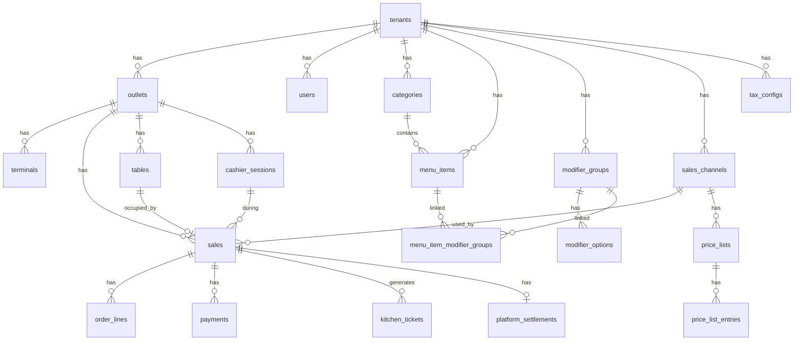
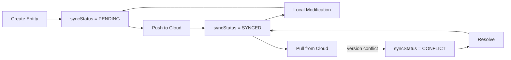

# 05 — Data Architecture

> Room Database, Schema, Migrations, dan Sync Metadata

---

## 5.1 Database Overview

| Item | Value |
|------|-------|
| ORM | Room (AndroidX) |
| Engine | SQLite |
| DB Version | 19 |
| Total Tables | 25 |
| Schema Export | Enabled (`exportSchema = true`) |
| Migration Strategy | Destructive (dev), proper migrations (production — planned) |

## 5.2 Entity-Relationship Diagram



> Diagram file: [`diagrams/data-01-er-diagram.mmd`](diagrams/data-01-er-diagram.mmd)

## 5.3 Table Schema

### Identity & Access

| Table | PK | FK | Sync | Deskripsi |
|-------|----|----|------|-----------|
| `tenants` | id (ULID) | — | Yes | Organisasi / brand |
| `outlets` | id (ULID) | tenantId | Yes | Cabang / lokasi |
| `users` | id (ULID) | tenantId | Yes | Staf dengan PIN & roles |
| `terminals` | id (ULID) | tenantId, outletId | Yes | Device / perangkat |

### Settings

| Table | PK | FK | Sync | Deskripsi |
|-------|----|----|------|-----------|
| `tenant_settings` | tenantId | tenantId | Yes | Config per tenant |
| `outlet_settings` | outletId | outletId, tenantId | Yes | Config per outlet (receipt, SC, tip) |
| `terminal_settings` | terminalId | — | Yes | Config per terminal (printer) |
| `tax_configs` | id (ULID) | tenantId | Yes | Konfigurasi pajak (multiple) |

### Catalog

| Table | PK | FK | Sync | Deskripsi |
|-------|----|----|------|-----------|
| `categories` | id (ULID) | tenantId | Yes | Kategori menu |
| `menu_items` | id (ULID) | tenantId, categoryId | Yes | Item menu |
| `modifier_groups` | id (ULID) | tenantId | Yes | Group modifier (reusable) |
| `modifier_options` | id (ULID) | groupId (CASCADE) | Yes | Opsi modifier |
| `menu_item_modifier_groups` | composite | menuItemId, modifierGroupId | Yes | Junction table |
| `price_lists` | id (ULID) | tenantId | Yes | Daftar harga per channel |
| `price_list_entries` | id (ULID) | priceListId | Yes | Override harga per item |

### Transaction

| Table | PK | FK | Sync | Deskripsi |
|-------|----|----|------|-----------|
| `sales` | id (ULID) | outletId, channelId, tableId?, cashierId | Yes | Transaksi penjualan |
| `order_lines` | id (ULID) | saleId | Yes | Item dalam transaksi |
| `payments` | id (ULID) | saleId | Yes | Pembayaran |
| `tables` | id (ULID) | outletId | Yes | Meja (dine in) |
| `cashier_sessions` | id (ULID) | outletId, userId, terminalId | Yes | Sesi kasir |
| `sales_channels` | id (ULID) | tenantId | Yes | Channel penjualan |
| `platform_settlements` | id (ULID) | saleId, channelId | Yes | Settlement platform delivery |

### Workflow

| Table | PK | FK | Sync | Deskripsi |
|-------|----|----|------|-----------|
| `kitchen_tickets` | id (ULID) | saleId | Yes | Tiket dapur |
| `kitchen_ticket_items` | id (ULID) | ticketId | Yes | Item tiket dapur |

### Customer

| Table | PK | FK | Sync | Deskripsi |
|-------|----|----|------|-----------|
| `customers` | id (ULID) | tenantId | Yes | Data pelanggan |

## 5.4 Sync Metadata

Setiap entity memiliki kolom sync metadata untuk mendukung multi-device sync:

```kotlin
data class SyncMetadata(
    val syncStatus: SyncStatus,        // PENDING, SYNCED, CONFLICT
    val syncVersion: Long,             // Monotonic version counter
    val createdAt: Long,               // Epoch millis
    val updatedAt: Long,               // Epoch millis
    val createdByTerminalId: String?,   // Terminal yang membuat
    val updatedByTerminalId: String?,   // Terminal yang terakhir mengubah
    val deletedAt: Long?               // Soft delete timestamp (null = active)
)
```



> Diagram file: [`diagrams/data-02-sync-metadata-flow.mmd`](diagrams/data-02-sync-metadata-flow.mmd)

### Soft Delete

Tidak ada hard delete. Semua delete menggunakan `deletedAt` timestamp:

```sql
-- Query active records only
SELECT * FROM menu_items WHERE deletedAt IS NULL AND tenantId = ?
```

## 5.5 Data Layer Structure

```
core/data/src/main/kotlin/id/stargan/intikasirfnb/data/
├── local/
│   ├── PosDatabase.kt              -- Room database definition
│   ├── entity/                     -- 25 Room @Entity classes
│   └── dao/                        -- 23 @Dao interfaces
├── repository/                     -- Repository implementations
├── mapper/                         -- Domain ↔ Entity mappers
├── sync/
│   └── NoOpSyncEngine.kt          -- Standalone mode sync
└── di/
    ├── DatabaseModule.kt           -- @Provides database + DAOs
    └── RepositoryModule.kt         -- @Binds repository impls
```

## 5.6 Mapper Pattern

Setiap entity memiliki mapper bidirectional:

```kotlin
// Domain → Room Entity
fun MenuItem.toEntity(): MenuItemEntity

// Room Entity → Domain
fun MenuItemEntity.toDomain(): MenuItem

// Room Entity with relations → Domain
fun MenuItemWithModifiers.toDomain(): MenuItem
```

## 5.7 Migration Strategy

| Fase | Strategy | Catatan |
|------|----------|---------|
| Development | `fallbackToDestructiveMigration()` | Data hilang saat schema change — OK untuk dev |
| Beta | Proper `Migration(N, N+1)` | Mulai preserve data |
| Production | Versioned migrations + backup | Wajib, tidak boleh data loss |

### Known Issue

> **B3**: Destructive migration masih aktif. Harus diganti sebelum beta release.

---

*Dokumen terkait: [06-Sync Architecture](06-sync-and-cloud-architecture.md) · [03-Domain Model](03-domain-model.md)*
