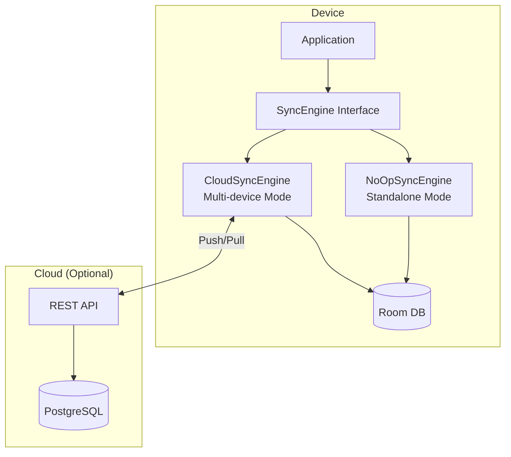
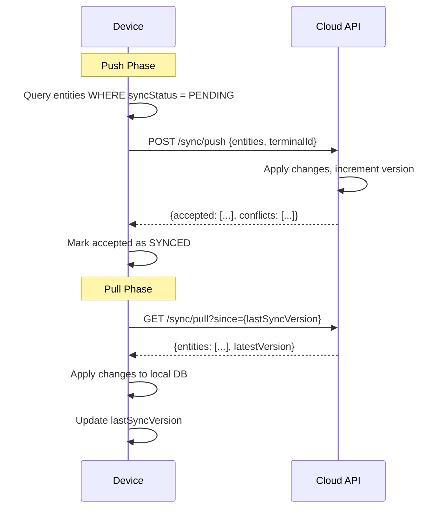
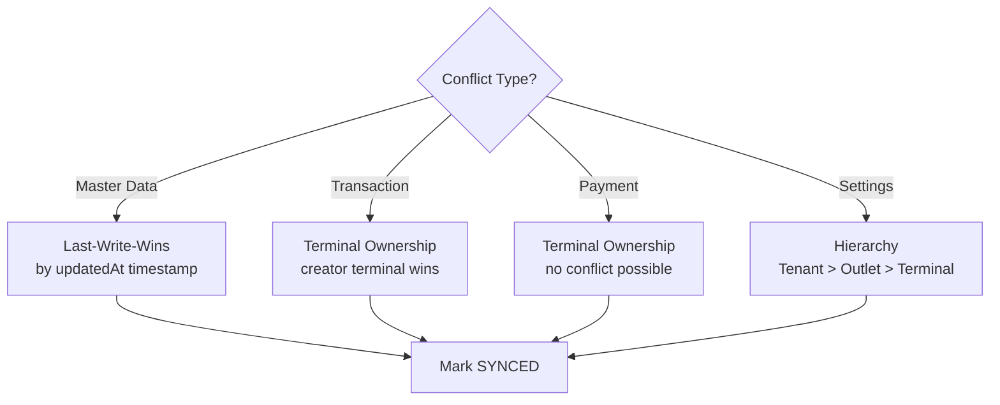
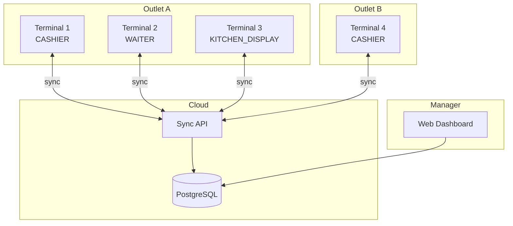
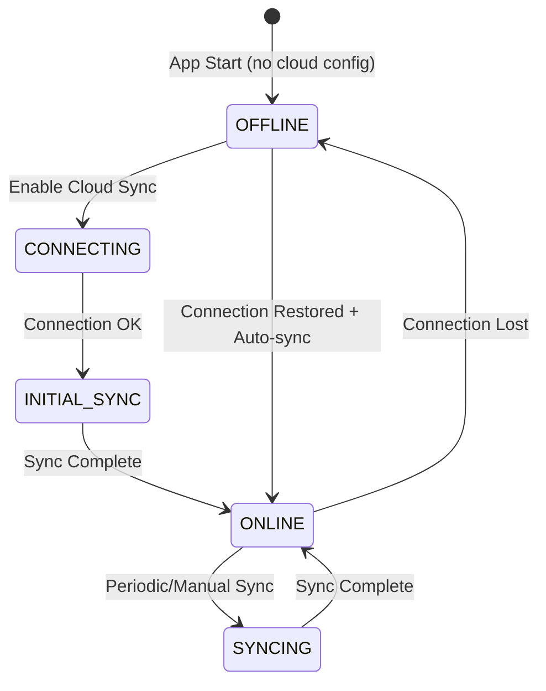

# 06 — Sync & Cloud Architecture

> Offline-First, Push-Pull Sync, Conflict Resolution, Cloud API

---

## 6.1 Design Principles

1. **Offline-first**: Local Room DB = source of truth saat offline
2. **Cloud optional**: 100% fungsional tanpa internet
3. **Sync non-blocking**: Background sync, tidak mengganggu operasi
4. **Eventual consistency**: Data akan konsisten setelah sync selesai
5. **Terminal ownership**: Transaksi dimiliki oleh terminal yang membuat

## 6.2 Sync Engine Architecture



> Diagram file: [`diagrams/sync-01-engine-architecture.mmd`](diagrams/sync-01-engine-architecture.mmd)

### SyncEngine Interface

```kotlin
interface SyncEngine {
    suspend fun notifyChange(entityType: String, entityId: String)
    suspend fun startPeriodicSync()
    suspend fun stopPeriodicSync()
    suspend fun syncNow(): SyncResult
    fun observeSyncStatus(): Flow<SyncStatus>
}
```

| Implementation | Mode | Status |
|----------------|------|--------|
| `NoOpSyncEngine` | Standalone (1 device) | DONE |
| `CloudSyncEngine` | Multi-device | NOT_STARTED (Phase 3) |

## 6.3 Push-Pull Sequence



> Diagram file: [`diagrams/sync-02-push-pull-sequence.mmd`](diagrams/sync-02-push-pull-sequence.mmd)

## 6.4 Conflict Resolution



> Diagram file: [`diagrams/sync-03-conflict-resolution.mmd`](diagrams/sync-03-conflict-resolution.mmd)

### Resolution Matrix

| Entity Type | Strategy | Rationale |
|-------------|----------|-----------|
| MenuItem, Category, Modifier | Last-Write-Wins (LWW) | Master data, editable by any manager |
| Sale, OrderLine | Terminal Ownership | Transaction dibuat oleh 1 terminal, tidak bisa conflict |
| Payment | Terminal Ownership | Idem |
| TaxConfig, Settings | Hierarchy (Tenant override) | Admin/owner setting berlaku global |
| Customer | LWW with merge | Merge field-level kalau memungkinkan |

## 6.5 Multi-Terminal Topology



> Diagram file: [`diagrams/sync-04-multi-terminal-topology.mmd`](diagrams/sync-04-multi-terminal-topology.mmd)

## 6.6 Cloud API Design (Planned)

### Endpoints

| Method | Endpoint | Deskripsi |
|--------|----------|-----------|
| POST | `/api/v1/sync/push` | Push local changes ke cloud |
| GET | `/api/v1/sync/pull` | Pull changes since version |
| POST | `/api/v1/terminal/register` | Register terminal baru |
| GET | `/api/v1/terminal/status` | Status sync terminal |

### API Stack (Planned)

| Component | Technology |
|-----------|-----------|
| Server | Self-hosted (customer infrastructure) |
| Framework | TBD |
| Database | PostgreSQL |
| Auth | Terminal certificate + API key |
| Protocol | REST + optional SSE for real-time |

## 6.7 Offline-to-Online Transition



> Diagram file: [`diagrams/sync-05-offline-online-transition.mmd`](diagrams/sync-05-offline-online-transition.mmd)

## 6.8 Implementation Status

| Component | Status | Phase |
|-----------|--------|-------|
| SyncEngine interface | DONE | 1 |
| NoOpSyncEngine | DONE | 1 |
| Sync metadata on all entities | DONE | 1 |
| CloudSyncEngine | NOT_STARTED | 3 |
| Cloud API server | NOT_STARTED | 3 |
| WorkManager periodic sync | NOT_STARTED | 3 |
| SSE real-time sync | NOT_STARTED | 4 |
| Multi-outlet aggregation | NOT_STARTED | 5 |

---

*Dokumen terkait: [05-Data Architecture](05-data-architecture.md) · [ADR-001](adr/ADR-001-offline-first-architecture.md) · [ADR-005](adr/ADR-005-sync-push-pull-with-versioning.md)*
