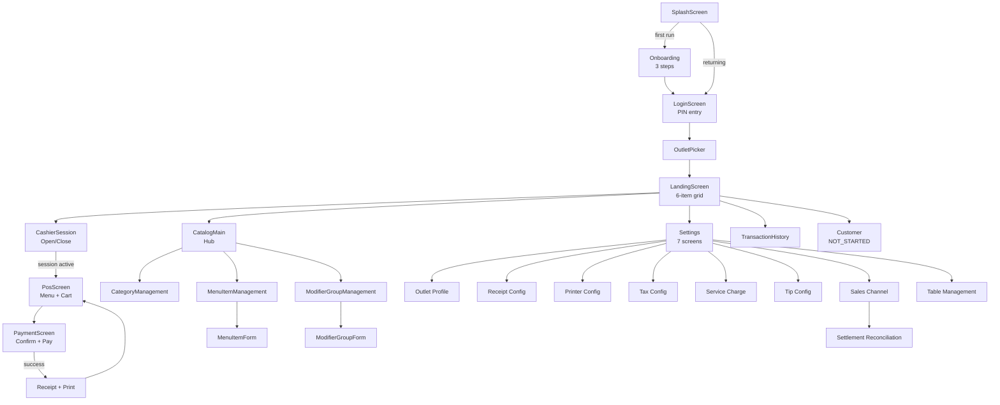
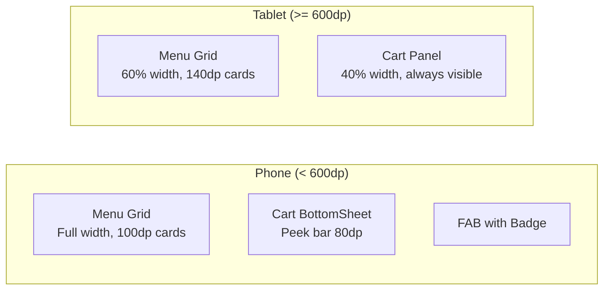

# 07 — UI & Navigation

> Screens, Navigation Graph, Responsive Layout, Jetpack Compose

---

## 7.1 Design System

| Aspek | Implementasi |
|-------|-------------|
| Framework | Jetpack Compose |
| Design Language | Material 3 |
| Theme | Light & Dark mode |
| Primary Color | Green palette |
| Typography | Material 3 default |
| Responsive | Phone (< 600dp) / Tablet (>= 600dp) |
| Image Loading | Coil 3.1.0 (AsyncImage) |

## 7.2 Navigation Graph



> Diagram file: [`diagrams/ui-01-navigation-graph.mmd`](diagrams/ui-01-navigation-graph.mmd)

## 7.3 Screen Inventory

### Auth Flow

| Screen | Route | Status | Deskripsi |
|--------|-------|--------|-----------|
| Splash | `splash` | DONE | Route ke onboarding atau login |
| Onboarding | `onboarding` | DONE | 3-step wizard (tenant, outlet, user) |
| Login | `login` | DONE | PIN entry + outlet picker |
| Outlet Picker | `outlet_picker` | DONE | Grid pemilihan outlet |

### Landing & Navigation

| Screen | Route | Status | Deskripsi |
|--------|-------|--------|-----------|
| Landing | `landing` | DONE | 6-item grid (POS, Catalog, Laporan, Settings, Pelanggan, Sesi) |

### PoS Flow

| Screen | Route | Status | Deskripsi |
|--------|-------|--------|-----------|
| Cashier Session | `cashier_session` | DONE | Open/close session, float, reconciliation |
| PoS Main | `pos` | DONE | Menu grid + cart, responsive phone/tablet |
| Payment | `payment/{saleId}` | DONE | Confirm + multi-payment + success + receipt |

### Catalog Management

| Screen | Route | Status | Deskripsi |
|--------|-------|--------|-----------|
| Catalog Hub | `catalog` | DONE | Navigation ke sub-screens |
| Category Management | `catalog/categories` | DONE | CRUD kategori dengan dialog |
| Menu Item List | `catalog/items` | DONE | List + filter + search |
| Menu Item Form | `catalog/items/{itemId}` | DONE | Add/edit menu item |
| Modifier Group List | `catalog/modifiers` | DONE | List dengan inline options |
| Modifier Group Form | `catalog/modifiers/{groupId}` | DONE | Add/edit modifier group |

### Settings

| Screen | Route | Status | Deskripsi |
|--------|-------|--------|-----------|
| Settings Hub | `settings` | DONE | Navigation ke sub-screens |
| Outlet Profile | `settings/outlet` | DONE | Nama, alamat, logo |
| Receipt Config | `settings/receipt` | DONE | Header, body toggles, footer |
| Printer Config | `settings/printer` | DONE | BT discovery, test print |
| Tax Config | `settings/tax` | DONE | Multiple tax, scope |
| Service Charge | `settings/sc` | DONE | Rate, applicable channels |
| Tip | `settings/tip` | DONE | Suggested %, custom |
| Sales Channel | `settings/channels` | DONE | Channel CRUD, platform config |
| Table Management | `settings/tables` | DONE | Grid, sections, CRUD |
| Settlement | `settings/settlement` | DONE | Tabs, batch settle, dispute |

### Transaction

| Screen | Route | Status | Deskripsi |
|--------|-------|--------|-----------|
| Transaction History | `history` | DONE | List past sales |

## 7.4 Responsive Layout



> Diagram file: [`diagrams/ui-02-responsive-layout.mmd`](diagrams/ui-02-responsive-layout.mmd)

### Breakpoint

- **< 600dp**: Phone layout (BottomSheetScaffold, FAB, smaller cards)
- **>= 600dp**: Tablet layout (split panel 60/40, larger cards)
- Ditentukan via `BoxWithConstraints { maxWidth }`

### Key UI Patterns

| Pattern | Implementasi |
|---------|-------------|
| Auto-create draft | First item tap creates DRAFT Sale |
| Same-item increment | Re-tap menu item increments qty |
| Staged payment | Stage multiple payments → review → commit batch |
| Optimistic UI | Settings update state immediately, persist in background |
| Modifier bottom sheet | Required/optional groups, price delta, validation |

## 7.5 Reusable Components

| Component | Deskripsi |
|-----------|-----------|
| `PinDots` | Visual PIN entry feedback |
| `NumPad` | Custom numeric keypad |
| `ChannelSelectorBar` | Scrollable channel chips |
| `ChannelChip` | Per-type icon + label |
| `TablePickerContent` | Reusable table grid bottom sheet |
| `ModifierSelectionContent` | Modifier selection bottom sheet |
| `StickyBottomSaveBar` | Fixed bottom bar with save button |
| `SettingsCard` | Consistent settings section card |
| `TestPrintSection` | Print test + status |

## 7.6 Currency & Formatting

```kotlin
// IDR formatting
val formatter = NumberFormat.getCurrencyInstance(Locale("id", "ID"))
// Output: Rp 25.000

// Cash display with thousand separators
fun formatCashDisplay(amount: Long): String
```

---

*Dokumen terkait: [01-Product Overview](01-product-overview.md) · [08-Module Structure](08-module-and-project-structure.md)*
