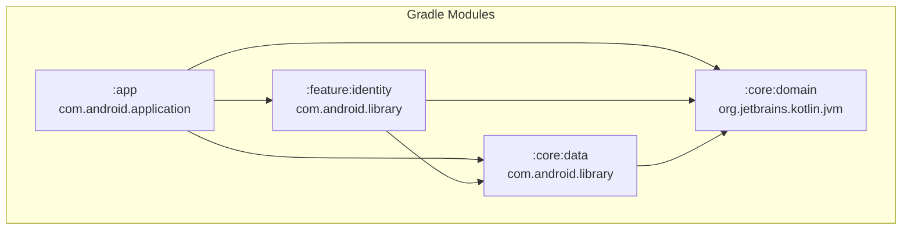

# 08 — Module & Project Structure

> Gradle Modules, Dependencies, Build Configuration

---

## 8.1 Module Hierarchy



> Diagram file: [`diagrams/module-01-hierarchy.mmd`](diagrams/module-01-hierarchy.mmd)

## 8.2 Module Responsibilities

| Module | Plugin | Deskripsi |
|--------|--------|-----------|
| `:app` | `com.android.application` | Presentation layer: Compose UI, ViewModels, Navigation, DI (AppModule) |
| `:feature:identity` | `com.android.library` | Auth & onboarding feature: splash, onboarding, login screens |
| `:core:domain` | `kotlin("jvm")` | Pure domain logic: entities, VOs, use cases, repository interfaces. **No Android dependency** |
| `:core:data` | `com.android.library` | Data layer: Room entities, DAOs, repository impls, mappers, DI modules |

## 8.3 Source Tree

```
id.stargan.intikasirfnb/
├── app/
│   ├── build.gradle.kts
│   └── src/main/kotlin/id/stargan/intikasirfnb/
│       ├── MainActivity.kt                    # Single-activity
│       ├── PosApplication.kt                  # @HiltAndroidApp
│       ├── di/AppModule.kt                    # @Provides 60+ use cases
│       ├── navigation/PosNavGraph.kt          # All routes
│       └── ui/
│           ├── pos/                            # PosScreen, PaymentScreen, CashierSession
│           ├── catalog/                        # Catalog CRUD screens
│           ├── settings/                       # 7+ settings screens
│           ├── landing/                        # LandingScreen
│           ├── history/                        # TransactionHistory
│           └── theme/                          # Material 3 theme
│
├── feature/identity/
│   ├── build.gradle.kts
│   └── src/main/kotlin/.../identity/
│       ├── ui/                                # Splash, Onboarding, Login, OutletPicker
│       └── viewmodel/                         # Auth ViewModels
│
├── core/domain/
│   ├── build.gradle.kts
│   └── src/main/kotlin/.../domain/
│       ├── transaction/                       # Sale, OrderLine, Payment, SalesChannel
│       ├── catalog/                           # MenuItem, Category, Modifier, PriceList
│       ├── identity/                          # Tenant, Outlet, User, Terminal
│       ├── settings/                          # TaxConfig, SC, Tip, Receipt, Printer
│       ├── customer/                          # Customer, Address
│       ├── inventory/                         # StockLevel, StockMovement
│       ├── supplier/                          # Supplier, PurchaseOrder
│       ├── accounting/                        # Journal, Account
│       ├── workflow/                          # KitchenTicket
│       ├── shared/                            # Money, SyncMetadata, UlidGenerator
│       ├── sync/                              # SyncEngine interface
│       ├── printer/                           # ESC/POS builder, receipt formatter
│       └── usecase/                           # All use cases (60+)
│
├── core/data/
│   ├── build.gradle.kts
│   └── src/main/kotlin/.../data/
│       ├── local/
│       │   ├── PosDatabase.kt                 # Room DB v19, 25 entities
│       │   ├── entity/                        # Room @Entity classes
│       │   └── dao/                           # Room @Dao interfaces
│       ├── repository/                        # Repository implementations
│       ├── mapper/                            # Domain ↔ Entity mappers
│       ├── sync/NoOpSyncEngine.kt             # Standalone sync
│       └── di/
│           ├── DatabaseModule.kt              # DB + DAOs
│           └── RepositoryModule.kt            # @Binds repos
│
├── docs/                                      # This documentation
├── gradle/                                    # Wrapper & version catalogs
├── build.gradle.kts                           # Root: plugins declaration
├── settings.gradle.kts                        # Module includes
└── gradle.properties                          # JVM heap, Kotlin style
```

## 8.4 Dependencies

### Core Libraries

| Library | Version | Module | Purpose |
|---------|---------|--------|---------|
| Kotlin | 2.3.10 | All | Language |
| Kotlin Coroutines | latest | domain, data, app | Async |
| ULID Creator | 5.2.3 | domain | ID generation |

### Android / Jetpack

| Library | Version | Module | Purpose |
|---------|---------|--------|---------|
| Compose BOM | 2026.02.00 | app, feature | UI framework |
| Material 3 | BOM-managed | app, feature | Design system |
| Navigation Compose | latest | app, feature | Navigation |
| Room | latest | data | SQLite ORM |
| Hilt | latest | all Android | DI |
| Hilt Navigation Compose | latest | app | ViewModel injection |
| Coil | 3.1.0 | app | Image loading |

### Network (Declared, Future Use)

| Library | Module | Purpose |
|---------|--------|---------|
| Retrofit | data | REST API client |
| OkHttp | data | HTTP client |
| Gson | data | JSON serialization |
| BouncyCastle | data | Ed25519 crypto |

### Testing

| Library | Version | Purpose |
|---------|---------|---------|
| JUnit | 4.13.2 | Unit test framework |
| MockK | 1.14.2 | Kotlin mocking |
| Turbine | 1.2.0 | Flow testing |
| Coroutines Test | latest | Coroutine testing |

## 8.5 Build Configuration

### Android Config

```kotlin
android {
    compileSdk = 36
    defaultConfig {
        minSdk = 29
        targetSdk = 35
    }
    compileOptions {
        sourceCompatibility = JavaVersion.VERSION_17
        targetCompatibility = JavaVersion.VERSION_17
    }
}
```

### Gradle Properties

```properties
org.gradle.jvmargs=-Xmx2048m
kotlin.code.style=official
```

### Planned Build Flavors

| Flavor | Purpose | Status |
|--------|---------|--------|
| `dev` | Development: dummy integrity, no cert pinning | NOT_STARTED |
| `prod` | Production: real Play Integrity, cert pinning | NOT_STARTED |

## 8.6 Permissions

```xml
<!-- AndroidManifest.xml -->
<uses-permission android:name="android.permission.CAMERA" />
<uses-permission android:name="android.permission.BLUETOOTH" />
<uses-permission android:name="android.permission.BLUETOOTH_ADMIN" />
<uses-permission android:name="android.permission.BLUETOOTH_CONNECT" />
<uses-permission android:name="android.permission.BLUETOOTH_SCAN"
    android:usesPermissionFlags="neverForLocation" />
<uses-permission android:name="android.permission.ACCESS_FINE_LOCATION"
    android:maxSdkVersion="30" />
<uses-permission android:name="android.permission.INTERNET" />
<uses-permission android:name="android.permission.READ_MEDIA_IMAGES" />
```

---

*Dokumen terkait: [02-Architecture Overview](02-architecture-overview.md) · [ADR-003](adr/ADR-003-single-module-per-layer.md)*
