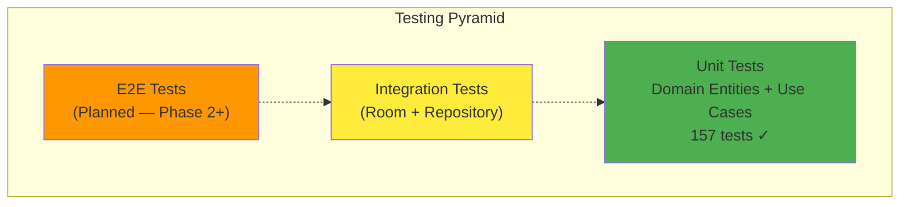

# 10 — Testing Strategy

> Strategi Testing, Coverage Targets, Tools, dan Best Practices

---

## 10.1 Testing Pyramid



> Diagram file: [`diagrams/test-01-pyramid.mmd`](diagrams/test-01-pyramid.mmd)

## 10.2 Current Test Coverage

| Area | Tests | Coverage | Status |
|------|-------|----------|--------|
| **Domain — Transaction** | 50 | Sale (34), SalesChannel (16) | DONE |
| **Domain — Catalog** | 58 | Models (17), UseCases (11), EscPosBuilder (30) | DONE |
| **Domain — Settings** | 21 | TaxConfig (5), SC (1), Tip (1), OutletSettings (2), Receipt (5), Printer (2), etc. | DONE |
| **Domain — Identity** | 9 | Terminal (6), User (3) | DONE |
| **Domain — Shared** | 19 | Money, SyncMetadata, ULID | DONE |
| **Data Layer** | 0 | — | NOT_STARTED |
| **ViewModel** | 0 | — | NOT_STARTED |
| **UI (Compose)** | 0 | — | NOT_STARTED |
| **Integration** | 0 | — | NOT_STARTED |
| **Total** | **157** | — | — |

## 10.3 Coverage Targets

| Layer | Target | Current | Prioritas |
|-------|--------|---------|-----------|
| Domain Entities | >= 90% | ~85% | P1 |
| Domain Use Cases | >= 80% | ~70% | P1 |
| Repository Impl | >= 60% | 0% | P2 |
| ViewModel | >= 50% | 0% | P3 |
| Compose UI | Smoke tests | 0% | P4 |

## 10.4 Test Tools

| Tool | Version | Purpose |
|------|---------|---------|
| JUnit 4 | 4.13.2 | Test framework |
| MockK | 1.14.2 | Kotlin-native mocking |
| Turbine | 1.2.0 | Flow testing (collectAsListOrNull, awaitItem) |
| kotlinx-coroutines-test | latest | `runTest`, `TestDispatcher` |
| (Planned) Robolectric | — | Android unit tests without emulator |
| (Planned) Compose Test | — | `ComposeTestRule`, semantic matchers |

## 10.5 Test Patterns

### Domain Entity Tests

```kotlin
class SaleTest {
    @Test
    fun `confirm transitions DRAFT to CONFIRMED`() {
        val sale = createDraftSale()
        val confirmed = sale.confirm()
        assertEquals(SaleStatus.CONFIRMED, confirmed.status)
    }

    @Test
    fun `void on PAID throws IllegalStateException`() {
        val paidSale = createPaidSale()
        assertThrows<IllegalStateException> { paidSale.void("reason") }
    }
}
```

### Use Case Tests (Fake Repositories)

```kotlin
class CatalogUseCaseTest {
    private val fakeRepo = FakeMenuItemRepository()
    private val useCase = SaveMenuItemUseCase(fakeRepo)

    @Test
    fun `save menu item persists to repository`() = runTest {
        val item = createMenuItem()
        useCase(item)
        assertEquals(item, fakeRepo.getById(item.id))
    }
}
```

### Flow Tests (Turbine)

```kotlin
@Test
fun `getCategories emits updated list`() = runTest {
    useCase.invoke(tenantId).test {
        val initial = awaitItem()
        assertEquals(0, initial.size)

        fakeRepo.save(createCategory())
        val updated = awaitItem()
        assertEquals(1, updated.size)

        cancelAndConsumeRemainingEvents()
    }
}
```

## 10.6 Test Organization

```
core/domain/src/test/kotlin/.../domain/
├── transaction/
│   ├── SaleTest.kt           # 34 tests — state machine, invariants
│   └── SalesChannelTest.kt   # 16 tests — factories, price resolution
├── catalog/
│   ├── CatalogModelsTest.kt  # 17 tests — ID uniqueness, defaults
│   └── CatalogUseCaseTest.kt # 11 tests — CRUD, search, delete
├── settings/
│   └── SettingsModelsTest.kt # 21 tests — all settings VOs
├── identity/
│   └── IdentityModelsTest.kt # 9 tests — Terminal, User
├── shared/
│   └── SharedModelsTest.kt   # 19 tests — Money, SyncMetadata
└── printer/
    └── EscPosBuilderTest.kt  # 30 tests — ESC/POS commands, receipt
```

## 10.7 Testing Conventions

1. **Test naming**: `` `descriptive name with backticks` ``
2. **Arrange-Act-Assert**: Jelas terpisah di setiap test
3. **Fake over Mock**: Prefer hand-written fake repositories di domain tests
4. **No Android deps**: Domain tests run on JVM (no Robolectric needed)
5. **One assertion per test**: Prefer fokus, multiple test methods over one test with many assertions

---

*Dokumen terkait: [03-Domain Model](03-domain-model.md) · [09-Use Case Reference](09-use-case-reference.md)*
