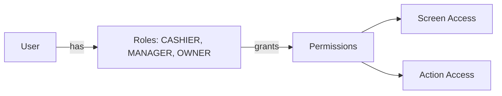
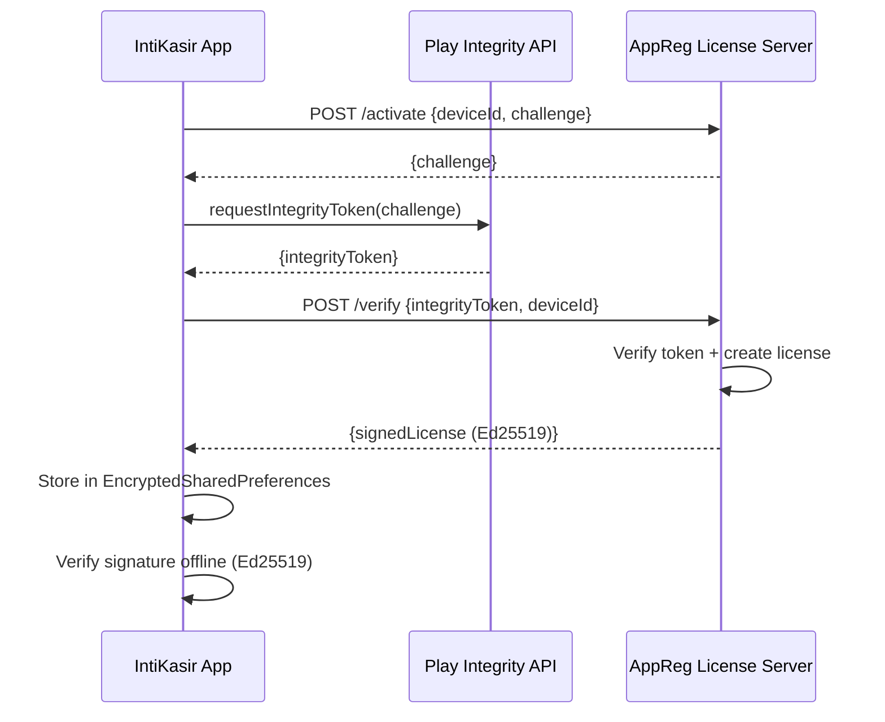

# 11 — Security & Licensing

> Autentikasi, PIN Security, AppReg Licensing, Encryption

---

## 11.1 Authentication

### PIN-Based Login

| Aspek | Implementasi |
|-------|-------------|
| Method | PIN 4-6 digit |
| Hashing | SHA-256 |
| Storage | `users.pinHash` di Room |
| Session | In-memory `SessionManager` (no token persistence) |
| Multi-outlet | User bisa akses multiple outlet via `outletIds` |

> **Known Issue**: SHA-256 untuk PIN hashing tidak ideal. Pertimbangkan upgrade ke bcrypt/argon2 sebelum production.

### Role-Based Access



> Diagram file: [`diagrams/security-01-rbac.mmd`](diagrams/security-01-rbac.mmd)

| Role | PoS | Catalog | Settings | Reports | Void | Close Session |
|------|-----|---------|----------|---------|------|---------------|
| CASHIER | Yes | View | No | No | No | Yes |
| MANAGER | Yes | CRUD | Partial | Yes | Yes | Yes |
| OWNER | Yes | CRUD | Full | Yes | Yes | Yes |

## 11.2 Licensing — AppReg (Phase 1.7)

### Overview



> Diagram file: [`diagrams/security-02-license-activation.mmd`](diagrams/security-02-license-activation.mmd)

### Components (All NOT_STARTED)

| Component | Deskripsi |
|-----------|-----------|
| `DeviceIdProvider` | Widevine DRM ID + ANDROID_ID fallback |
| `PlayIntegrityHelper` | Dev: dummy token. Prod: real Play Integrity API |
| `AppRegApi` | Retrofit interface ke AppReg server |
| `LicenseStorage` | EncryptedSharedPreferences (Android Keystore-backed) |
| `LicenseVerifier` | Ed25519 offline signature verification |
| `LicenseRevalidator` | Periodic online check + 7-day offline grace period |
| `ActivationScreen` | UI untuk input activation code |

### Security Layers

| Layer | Dev Flavor | Prod Flavor |
|-------|-----------|-------------|
| Play Integrity | Dummy (always pass) | Real API call |
| Certificate Pinning | Disabled | Enabled (BouncyCastle) |
| License Check | Bypass option | Enforced |
| Device Binding | Relaxed | Strict (Widevine ID) |

### License Lifecycle

```
NOT_ACTIVATED → ACTIVATING → ACTIVE → EXPIRED
                                ↓
                          GRACE_PERIOD (7 days offline)
                                ↓
                            EXPIRED
```

## 11.3 Data Security

| Aspek | Approach |
|-------|----------|
| Local DB | Not encrypted (planned: SQLCipher for production) |
| Credentials | PIN hash only, no plaintext |
| License | EncryptedSharedPreferences |
| Network | HTTPS + certificate pinning (production) |
| Soft Delete | No hard delete — audit trail preserved |
| Audit | `createdByTerminalId`, `updatedByTerminalId` on all entities |

## 11.4 Bluetooth Security

| Aspek | Approach |
|-------|----------|
| Protocol | Bluetooth SPP (Serial Port Profile) |
| Pairing | Required (OS-level) |
| Permissions | BLUETOOTH_CONNECT + BLUETOOTH_SCAN (API 31+) |
| Location | `neverForLocation` flag, `ACCESS_FINE_LOCATION` maxSdkVersion=30 |

---

*Dokumen terkait: [06-Sync Architecture](06-sync-and-cloud-architecture.md) · [12-Printing](12-printing-and-peripherals.md)*
