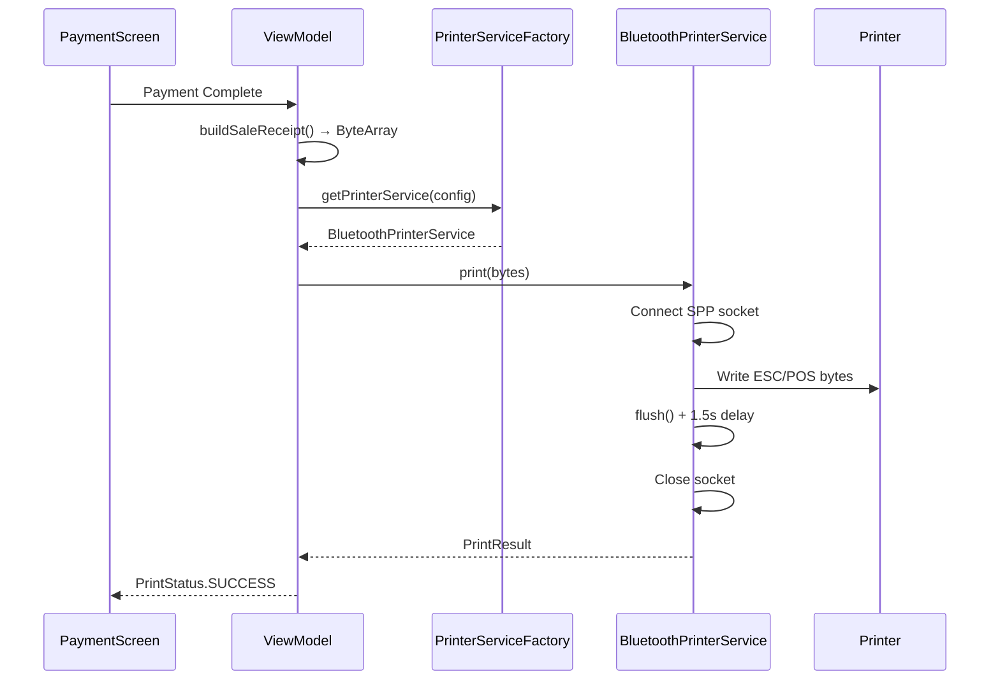

# 12 — Printing & Peripherals

> ESC/POS Thermal Printer, Bluetooth Integration, Receipt Formatting

---

## 12.1 Printer Architecture

```mermaid
graph TB
    subgraph "Domain Layer"
        ESCPOS[EscPosBuilder<br/>Command builder]
        RECEIPT[buildSaleReceipt()<br/>Receipt formatter]
        LOGO[LogoBitmapProcessor<br/>Floyd-Steinberg dithering]
    end

    subgraph "Infrastructure"
        PSF[PrinterServiceFactory<br/>Singleton, BT discovery]
        BPS[BluetoothPrinterService<br/>SPP connection]
    end

    subgraph "Hardware"
        PRINTER[Thermal Printer<br/>58mm / 80mm]
    end

    RECEIPT --> ESCPOS
    LOGO --> ESCPOS
    ESCPOS --> BPS
    PSF --> BPS
    BPS -->|Bluetooth SPP| PRINTER
```

> Diagram file: [`diagrams/print-01-architecture.mmd`](diagrams/print-01-architecture.mmd)

## 12.2 Supported Connections

| Type | Constant | Status | Deskripsi |
|------|----------|--------|-----------|
| Bluetooth | `BLUETOOTH` | DONE | SPP profile, auto-discovery |
| USB | `USB` | NOT_STARTED | USB OTG planned |
| Network | `NETWORK` | NOT_STARTED | TCP/IP planned |
| None | `NONE` | DONE | No printer configured |

## 12.3 PrinterConfig

```kotlin
data class PrinterConfig(
    val connectionType: PrinterConnectionType,  // NONE, BLUETOOTH, USB, NETWORK
    val address: String,                        // MAC address / IP
    val name: String,                           // Display name
    val autoCut: Boolean,                       // Auto paper cut
    val density: Int,                           // Print density 1-8
    val autoPrintReceipt: Boolean,              // Auto print on payment
    val receiptCopies: Int,                     // Number of copies
    val openCashDrawer: Boolean                 // Kick cash drawer
)
```

## 12.4 ESC/POS Builder

Builder pattern untuk konstruksi ESC/POS commands:

```kotlin
EscPosBuilder()
    .initialize()                    // ESC @
    .setAlignment(CENTER)            // ESC a
    .setBold(true)                   // ESC E
    .text("NAMA TOKO")
    .setBold(false)
    .newLine()
    .separator('-')                  // --------------------------------
    .setAlignment(LEFT)
    .textColumns("Nasi Goreng", "Rp 25.000", 32)
    .textColumns("  Extra Pedas", "+Rp 3.000", 32)
    .separator('-')
    .textColumns("TOTAL", "Rp 28.000", 32)
    .newLine()
    .rasterImage(logoBitmap)         // GS v 0 (raster bitmap)
    .cut()                           // GS V
    .openCashDrawer()                // ESC p
    .build()                         // ByteArray
```

### Key ESC/POS Commands

| Command | Hex | Deskripsi |
|---------|-----|-----------|
| Initialize | `1B 40` | Reset printer |
| Bold On | `1B 45 01` | Enable bold |
| Bold Off | `1B 45 00` | Disable bold |
| Center | `1B 61 01` | Center alignment |
| Left | `1B 61 00` | Left alignment |
| Cut | `1D 56 00` | Full cut |
| Raster Image | `1D 76 30` | Print bitmap |
| Cash Drawer | `1B 70 00` | Kick drawer |

## 12.5 Receipt Layout

```
┌─────────────────────────────────┐
│          [LOGO IMAGE]           │  ← Raster bitmap (optional)
│         NAMA RESTORAN           │  ← ReceiptConfig.header.businessName
│      Jl. Contoh No. 123        │  ← header.address
│        Tel: 021-1234567         │  ← header.phone
│       NPWP: 12.345.678.9       │  ← header.npwpNumber (optional)
│     Custom line 1, 2, 3...     │  ← header.customLines (optional)
├─────────────────────────────────┤
│ No: INV-001    12/03/2026 14:30│  ← Receipt number, date
│ Kasir: Budi    Channel: Dine In│  ← Cashier, channel
│ Meja: A3                       │  ← Table (if dine in)
├─────────────────────────────────┤
│ Nasi Goreng          Rp 25.000 │  ← Item name, total
│   1 x Rp 25.000               │  ← Qty x unit price
│   Extra Pedas        +Rp 3.000 │  ← Modifier
│ Es Teh Manis         Rp  8.000 │
│   1 x Rp 8.000                │
├─────────────────────────────────┤
│ Subtotal             Rp 36.000 │  ← body.showSubtotal
│ Service Charge 5%    Rp  1.800 │  ← body.showServiceCharge
│ PPN 11%              Rp  4.158 │  ← body.showTax (per tax line)
│ Tip                  Rp  5.000 │  ← body.showTip
├─────────────────────────────────┤
│ TOTAL                Rp 46.958 │
├─────────────────────────────────┤
│ Tunai                Rp 50.000 │  ← body.showPaymentMethod
│ Kembalian            Rp  3.042 │  ← body.showChange
├─────────────────────────────────┤
│     Terima kasih!              │  ← footer.thankYouMessage
│     @restoran_ig               │  ← footer.socialMedia
│     Custom footer text         │  ← footer.customText
│         [QR CODE]              │  ← footer.barcodeData (optional)
└─────────────────────────────────┘
```

## 12.6 Receipt Config (Body Toggles)

| Toggle | Default | Deskripsi |
|--------|---------|-----------|
| `showSubtotal` | true | Tampilkan subtotal |
| `showTax` | true | Tampilkan detail pajak |
| `showServiceCharge` | true | Tampilkan service charge |
| `showTip` | true | Tampilkan tip |
| `showDiscount` | true | Tampilkan diskon |
| `showPaymentMethod` | true | Tampilkan metode bayar |
| `showChange` | true | Tampilkan kembalian |
| `showCashierName` | true | Tampilkan nama kasir |
| `showOrderNumber` | true | Tampilkan nomor order |

## 12.7 Bluetooth Printing Flow



> Diagram file: [`diagrams/print-02-bluetooth-flow.mmd`](diagrams/print-02-bluetooth-flow.mmd)

### Known Issues

- **Flush delay**: `OutputStream.flush()` only flushes Java buffer, not Bluetooth transport. Added 1.5s delay before socket close.
- **Floyd-Steinberg dithering**: Logo images converted to 1-bit with dithering for thermal printer compatibility.

## 12.8 Paper Width Support

| Width | Characters/Line | Use Case |
|-------|----------------|----------|
| 58mm | 32 chars | Small portable printers |
| 80mm | 48 chars | Standard POS printers |

---

*Dokumen terkait: [04-F&B Specialization](04-fnb-domain-specialization.md) · [07-UI & Navigation](07-ui-and-navigation.md)*
