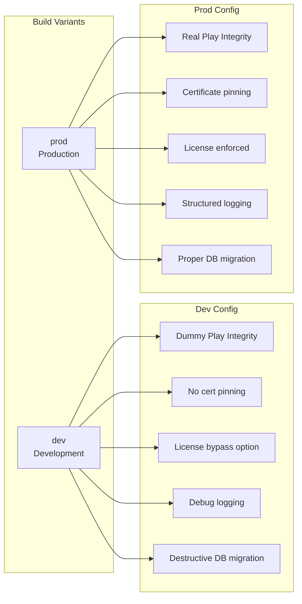

# 13 — Deployment & Release

> Build Flavors, CI/CD, Release Process, Versioning

---

## 13.1 Versioning

| Format | Contoh | Deskripsi |
|--------|--------|-----------|
| Semantic Versioning | `1.0.0` | MAJOR.MINOR.PATCH |
| Current | `0.x.x` | Pre-release / development |

### Changelog

Mengikuti [Keep a Changelog](https://keepachangelog.com/en/1.1.0/) format di `CHANGELOG.md`.

## 13.2 Build Flavors (Planned)



> Diagram file: [`diagrams/deploy-01-build-flavors.mmd`](diagrams/deploy-01-build-flavors.mmd)

## 13.3 CI/CD Pipeline (Planned)

| Stage | Tools | Status |
|-------|-------|--------|
| Lint | Android Lint, ktlint | NOT_STARTED |
| Unit Tests | JUnit + MockK | Tests exist, CI not wired |
| Build | Gradle, AGP | Manual |
| Sign | Android Keystore | NOT_STARTED |
| Distribute | TBD (Firebase App Distribution / manual APK) | NOT_STARTED |
| Play Store | Google Play Console | NOT_STARTED |

### Planned CI Pipeline

```
Push → Lint → Unit Tests → Build Debug → (on tag) Build Release → Sign → Distribute
```

## 13.4 Release Checklist

Pre-release checklist untuk setiap versi:

- [ ] Semua unit tests passing
- [ ] No destructive migration (proper Migration objects)
- [ ] Database schema exported
- [ ] CHANGELOG.md updated
- [ ] Version bumped di `build.gradle.kts`
- [ ] APK signed with release keystore
- [ ] ProGuard/R8 rules tested
- [ ] License activation flow tested
- [ ] Printer integration tested on physical device
- [ ] Smoke test: full PoS flow end-to-end

## 13.5 Environment Configuration

| Environment | Database | API | License | Logging |
|-------------|----------|-----|---------|---------|
| **Development** | Destructive migration | Mock / localhost | Bypass | Verbose |
| **Staging** | Proper migration | Staging server | Test server | Debug |
| **Production** | Proper migration | Production server | Production server | Error only |

## 13.6 APK Distribution

| Method | Use Case | Status |
|--------|----------|--------|
| Direct APK | Development / testing | Active |
| Firebase App Distribution | Beta testers | NOT_STARTED |
| Google Play Store | Production | NOT_STARTED |
| Self-hosted | Enterprise customers | NOT_STARTED |

## 13.7 ProGuard / R8 Considerations

| Library | Keep Rule Needed | Notes |
|---------|-----------------|-------|
| Room | Yes | Entity classes, DAO |
| Hilt | Automatic | Generated code |
| Retrofit | Yes | API interfaces |
| Gson | Yes | DTO classes |
| BouncyCastle | Yes | Crypto providers |

---

*Dokumen terkait: [11-Security](11-security-and-licensing.md) · [08-Module Structure](08-module-and-project-structure.md)*
