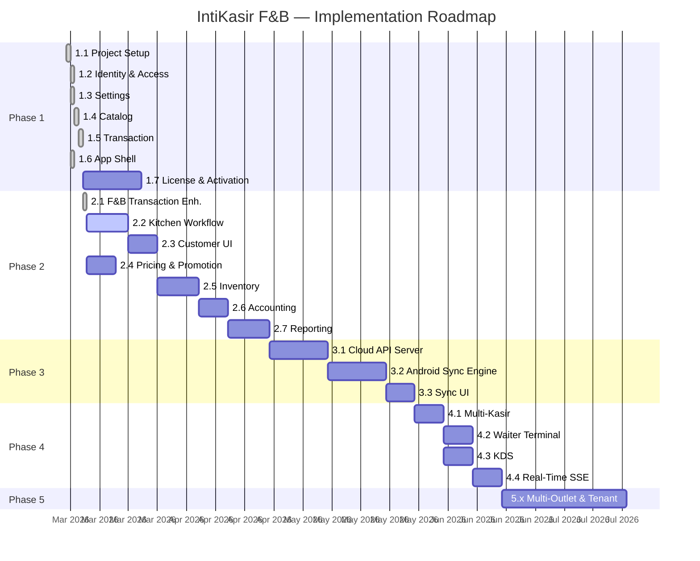
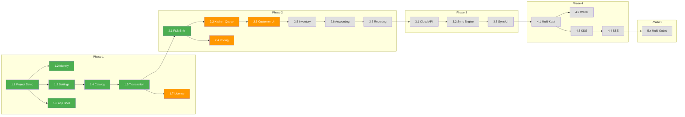

# Implementation Plan — IntiKasir F&B

> Living document · Update setiap kali ada perubahan scope, prioritas, atau timeline.
>
> **Last updated**: 2026-03-12
> **Version**: 3.0.0
> **Status dashboard**: [implementation-status.md](implementation-status.md)

---

## Revision History

| Version | Date | Author | Changes |
|---------|------|--------|---------|
| 3.0.0 | 2026-03-12 | — | Restructure mengikuti best practice: phase gates, RACI, dependency map, tech debt register |
| 2.0.0 | 2026-03-12 | — | Dokumentasi ulang format baru (16 numbered docs) |
| 1.0.0 | 2026-03-07 | — | Initial implementation plan |

---

## Table of Contents

- [1. Executive Summary](#1-executive-summary)
- [2. Guiding Principles](#2-guiding-principles)
- [3. Roadmap & Phase Overview](#3-roadmap--phase-overview)
- [4. Phase 1 — Foundation & Standalone MVP](#4-phase-1--foundation--standalone-mvp)
- [5. Phase 2 — Full PoS Features](#5-phase-2--full-pos-features)
- [6. Phase 3 — Cloud Sync Foundation](#6-phase-3--cloud-sync-foundation)
- [7. Phase 4 — Multi-Terminal](#7-phase-4--multi-terminal)
- [8. Phase 5 — Multi-Outlet & Multi-Tenant](#8-phase-5--multi-outlet--multi-tenant)
- [9. Cross-Cutting Concerns](#9-cross-cutting-concerns)
- [10. Dependency Map](#10-dependency-map)
- [11. Risk Register](#11-risk-register)
- [12. Technical Debt Register](#12-technical-debt-register)
- [13. Definition of Done](#13-definition-of-done)
- [14. Phase Gate Criteria](#14-phase-gate-criteria)
- [15. Document References](#15-document-references)

---

## 1. Executive Summary

| Item | Detail |
|------|--------|
| **Product** | IntiKasir F&B — Android PoS untuk restoran & kafe |
| **Stack** | Kotlin · MVVM · Clean Architecture · DDD · Room · Hilt · Jetpack Compose |
| **Architecture** | Offline-first, sync-ready, single-activity |
| **Goal** | Standalone PoS → Cloud Sync → Multi-Terminal → Multi-Outlet/Tenant |
| **Total Tasks** | 180 across 5 phases |
| **Current Progress** | 46% overall (Phase 1: 71%, Phase 2: 50%) |

### Milestone Summary

| Phase | Milestone | Target | Status |
|-------|-----------|--------|--------|
| 1 | Foundation & Standalone MVP | Q2 2026 | 🟡 IN_PROGRESS (78%) |
| 2 | Full PoS Features | Q3 2026 | 🟡 IN_PROGRESS (50%) |
| 3 | Cloud Sync Foundation | Q4 2026 | ⚪ NOT_STARTED |
| 4 | Multi-Terminal | Q1 2027 | ⚪ NOT_STARTED |
| 5 | Multi-Outlet & Multi-Tenant | Q2 2027 | ⚪ NOT_STARTED |

### Roadmap



> Diagram file: [`diagrams/impl-01-roadmap-detail.mmd`](diagrams/impl-01-roadmap-detail.mmd)

---

## 2. Guiding Principles

| # | Principle | Rationale |
|---|-----------|-----------|
| 1 | **Offline-first always** | Setiap fitur HARUS berfungsi tanpa internet. Cloud sync adalah enhancement, bukan requirement. |
| 2 | **Sync-ready from day one** | Semua entity menyertakan sync metadata (ULID, syncStatus, syncVersion, terminalId) meskipun sync belum aktif. |
| 3 | **Vertical slices** | Bangun fitur end-to-end (domain → data → UI) satu per satu, bukan layer per layer. |
| 4 | **Test as you go** | Unit test domain logic, integration test Room DAO, UI test critical flows. |
| 5 | **Ship incrementally** | Setiap phase menghasilkan aplikasi yang bisa dipakai (releasable). |
| 6 | **DDD discipline** | Domain layer pure Kotlin, tidak ada Android dependency. Ubiquitous language konsisten. |
| 7 | **Minimize tech debt** | Track dan bayar tech debt secara proaktif — jangan biarkan menumpuk lintas phase. |

---

## 3. Roadmap & Phase Overview

```
Phase 1: Foundation & Standalone MVP          ← CURRENT
  ├── 1.1 Project setup, module structure, shared kernel
  ├── 1.2 Identity & Access (Tenant, Outlet, User, Terminal)
  ├── 1.3 Settings (Tax, SC, Tip, Numbering, Receipt, Printer)
  ├── 1.4 Catalog (MenuItem, Category, Modifier)
  ├── 1.5 Transaction (Sale, Payment, CashierSession, SalesChannel)
  ├── 1.6 App Shell (landing, navigation, theme)
  └── 1.7 License & Activation (AppReg, Ed25519, Play Integrity)

Phase 2: Full PoS Features                   ← ACTIVE (partial)
  ├── 2.1 F&B Transaction Enhancements ✅
  ├── 2.2 Workflow / Kitchen Queue
  ├── 2.3 Customer (CRUD, link to sale)
  ├── 2.4 Pricing & Promotion (discount, coupon)
  ├── 2.5 Inventory (stock deduction, recipe-based)
  ├── 2.6 Accounting (journal, COGS)
  └── 2.7 Reporting (sales, commission, export)

Phase 3: Cloud Sync Foundation
  ├── 3.1 Cloud API Server (PostgreSQL, REST)
  ├── 3.2 Android Sync Engine (CloudSyncEngine, WorkManager)
  └── 3.3 Sync UI (settings, indicator, conflict resolution)

Phase 4: Multi-Terminal
  ├── 4.1 Multi-Kasir (terminal-scoped sessions)
  ├── 4.2 Waiter Terminal (order taking)
  ├── 4.3 Kitchen Display System (KDS)
  └── 4.4 Real-Time SSE

Phase 5: Multi-Outlet & Multi-Tenant
  ├── Data isolation, cross-outlet reporting
  ├── Central menu management
  └── Tenant admin
```

---

## 4. Phase 1 — Foundation & Standalone MVP

> **Goal**: Aplikasi bisa diinstall dan digunakan sebagai kasir F&B di 1 device, 1 outlet.
> **Progress**: 78% (96% excl. License & Activation)
> **Exit criteria**: Lihat [Phase Gate 1](#phase-gate-1)

### 4.1 Project Setup & Infrastructure

| # | Task | Layer | Depends On | Status | Notes |
|---|------|-------|------------|--------|-------|
| 1.1.1 | Setup Android project (Kotlin, Gradle KTS) | infra | — | ✅ DONE | Kotlin 2.3.10, Compose BOM 2026.02.00, Material 3 |
| 1.1.2 | Module structure: `:core:domain`, `:core:data`, `:app` | infra | 1.1.1 | ✅ DONE | + `:feature:identity` module |
| 1.1.3 | Configure Hilt DI | infra | 1.1.1 | ✅ DONE | DatabaseModule, RepositoryModule, AppModule |
| 1.1.4 | Room database + migrations | data | 1.1.2 | ✅ DONE | Room v19, 25 tables, `fallbackToDestructiveMigration` — [B3] open |
| 1.1.5 | Jetpack Navigation (single activity) | presentation | 1.1.2 | ✅ DONE | Navigation Compose, 22+ routes |
| 1.1.6 | ULID generator library | domain | 1.1.2 | ✅ DONE | ulid-creator 5.2.3, all 15 ID classes migrated from UUID |
| 1.1.7 | Shared kernel (`Syncable`, `Money`, ID VOs, `SyncMetadata`) | domain | 1.1.2 | ✅ DONE | Money, Syncable interface, SyncMetadata, SyncStatus |
| 1.1.8 | `SyncEngine` interface + `NoOpSyncEngine` | domain+data | 1.1.7 | ✅ DONE | SyncEngine in domain/sync, NoOpSyncEngine in data/sync, DI binding |
| 1.1.9 | Test infrastructure (JUnit, MockK, Turbine) | infra | 1.1.2 | ✅ DONE | JUnit 4.13.2, MockK 1.14.2, Turbine 1.2.0, kotlinx-coroutines-test |
| 1.1.10 | CI: lint, compile, unit tests | infra | 1.1.9 | ⬚ NOT_STARTED | |

### 4.2 Identity & Access Context

| # | Task | Layer | Depends On | Status | Notes |
|---|------|-------|------------|--------|-------|
| 1.2.1 | `Tenant` entity + `TenantId` VO | domain | 1.1.7 | ✅ DONE | |
| 1.2.2 | `Outlet` entity + `OutletId` VO | domain | 1.2.1 | ✅ DONE | |
| 1.2.3 | `User` entity + `Role` + `Permission` VOs | domain | 1.2.1 | ✅ DONE | RBAC, User.hasAccessToOutlet() |
| 1.2.4 | `Terminal` entity + `TerminalType` + `TerminalStatus` | domain | 1.2.2 | ✅ DONE | CASHIER, WAITER, KITCHEN_DISPLAY, MANAGER |
| 1.2.5 | Repository interfaces (4) | domain | 1.2.1-4 | ✅ DONE | Tenant, Outlet, User, Terminal |
| 1.2.6 | Events (`UserLoggedIn`, `TerminalRegistered`) | domain | 1.2.3-4 | ⬚ NOT_STARTED | Deferred to Phase 4 — use case orchestration sufficient for standalone |
| 1.2.7 | Room entities + DAOs (4) | data | 1.2.5 | ✅ DONE | All with sync metadata + FK indices |
| 1.2.8 | Repository implementations (4) | data | 1.2.7 | ✅ DONE | |
| 1.2.9 | Mappers (Room entity ↔ Domain model) | data | 1.2.7 | ✅ DONE | IdentityMappers.kt |
| 1.2.10 | Use cases (7) | domain | 1.2.5 | ✅ DONE | GetTenant, GetUserByEmail, GetOutletsByTenant, LoginWithPin, SelectOutlet, CheckOnboarding, CompleteOnboarding |
| 1.2.11 | UI: Setup wizard (3-step) | presentation | 1.2.10 | ✅ DONE | Business info → outlet info → owner+PIN |
| 1.2.12 | UI: Login screen (PIN + outlet picker) | presentation | 1.2.10 | ✅ DONE | Custom NumPad + PinDots |
| 1.2.13 | Unit tests: domain entities | test | 1.2.1-6 | ✅ DONE | 9 tests: Terminal(6), User(3) |
| 1.2.14 | Integration tests: Room DAOs | test | 1.2.7-9 | ⬚ NOT_STARTED | |

### 4.3 Settings Context

| # | Task | Layer | Depends On | Status | Notes |
|---|------|-------|------------|--------|-------|
| 1.3.1 | `TenantSettings`, `OutletSettings` aggregates | domain | 1.2.1 | ✅ DONE | TenantSettings: currency, numbering, syncEnabled. OutletSettings: timezone, SC, Tip, ReceiptConfig |
| 1.3.2 | `TerminalSettings` + `PrinterConfig` | domain | 1.2.4 | ✅ DONE | PrinterConfig: connectionType(NONE/BT/USB/NET), address, autoCut, density, autoPrint, copies |
| 1.3.3 | `SyncSettings` VO | domain | 1.1.7 | ✅ DONE | `syncEnabled` field in TenantSettings |
| 1.3.4 | `NumberingSequenceConfig` VO | domain | 1.3.1 | ✅ DONE | prefix, paddingLength, nextNumber |
| 1.3.4b | `TaxConfig` entity | domain | 1.3.1 | ✅ DONE | TaxConfigId(ULID), TaxScope(ALL_ITEMS/SPECIFIC_CATEGORIES/SPECIFIC_ITEMS), >1 tax (PPN, PB1) |
| 1.3.4c | `ServiceChargeConfig` VO | domain | 1.3.1 | ✅ DONE | isEnabled, rate, applicableChannelTypes, isIncludedInPrice |
| 1.3.4d | `TipConfig` VO | domain | 1.3.1 | ✅ DONE | suggestedPercentages, allowCustomAmount, applicableChannelTypes |
| 1.3.4e | `ReceiptConfig` (header/body/footer/paperWidth) | domain | 1.3.1 | ✅ DONE | Logo, NPWP, 9 body toggles, QR/barcode, 58mm/80mm |
| 1.3.5 | Repository interfaces (4) | domain | 1.3.1-2 | ✅ DONE | TenantSettings, OutletSettings, TaxConfig, TerminalSettings |
| 1.3.6 | Use cases (6) | domain | 1.3.5 | ✅ DONE | Get/SaveTenantSettings, Get/SaveOutletSettings, GetActiveTaxConfigs, SaveTaxConfig |
| 1.3.7 | Room entities + DAOs + repos + mappers | data | 1.3.5 | ✅ DONE | OutletSettingsEntity (full receipt columns), TerminalSettingsEntity (no FK), TaxConfigEntity |
| 1.3.8 | UI: Settings screens (7) | presentation | 1.3.6 | ✅ DONE | SettingsMain, OutletProfile, Receipt, Printer, Tax, SC, Tip. BT discovery, optimistic UI |
| 1.3.9 | `NumberingSequence` logic (per terminal per day) | domain | 1.3.4 | ⬚ NOT_STARTED | Format: {OutletCode}-{TerminalCode}-{YYYYMMDD}-{Seq} |
| 1.3.10 | Unit tests | test | 1.3.1-6 | ✅ DONE | 21 tests |

### 4.4 Catalog Context

| # | Task | Layer | Depends On | Status | Notes |
|---|------|-------|------------|--------|-------|
| 1.4.1 | `Category` aggregate (hierarchical) | domain | 1.1.7 | ✅ DONE | parentId, sortOrder, isActive |
| 1.4.2 | `MenuItem` aggregate | domain | 1.4.1 | ✅ DONE | id, tenantId, categoryId, name, imageUri, basePrice, taxCode |
| 1.4.3 | `ModifierGroup` + `ModifierOption` + `MenuItemModifierLink` | domain | 1.4.2 | ✅ DONE | Separate entities, reusable across items via junction table with per-item overrides |
| 1.4.4 | VOs (`ProductId`, `CategoryId`, `ModifierGroupId`, etc.) | domain | 1.1.7 | ✅ DONE | + IngredientId, UoM enum |
| 1.4.5 | Events (`ProductCreated`, `ProductUpdated`) | domain | 1.4.2 | ⬚ NOT_STARTED | Deferred to Phase 4 — not needed for standalone |
| 1.4.6 | Repository interfaces (3) | domain | 1.4.2 | ✅ DONE | MenuItem, Category, ModifierGroup |
| 1.4.7 | Use cases (11) | domain | 1.4.6 | ✅ DONE | Get/Save/DeleteCategory, Get/GetById/Save/Delete/GetByCategory/SearchMenuItems, Save/Get/DeleteModifierGroup |
| 1.4.8 | Room entities + DAOs + mappers (5 entities, 5 DAOs) | data | 1.4.6 | ✅ DONE | Category, MenuItem, ModifierGroup, ModifierOption, MenuItemModifierGroup |
| 1.4.9 | Repository implementations (3) | data | 1.4.8 | ✅ DONE | With modifier links, atomic operations |
| 1.4.10 | UI: Category management | presentation | 1.4.7 | ✅ DONE | CRUD dialog, hierarchical, item count, CatalogMainScreen hub |
| 1.4.11 | UI: Menu item management + form | presentation | 1.4.7 | ✅ DONE | List + filter + search + add/edit form (image picker, category dropdown) |
| 1.4.12 | UI: Modifier group management + form | presentation | 1.4.7 | ✅ DONE | List + inline options + dynamic form (mutableStateListOf) |
| 1.4.13 | Unit tests: domain + use cases | test | 1.4.1-7 | ✅ DONE | 58 tests: Models(17), UseCases(11), EscPosBuilder(30) |
| 1.4.14 | Integration tests: Room DAOs | test | 1.4.8-9 | ⬚ NOT_STARTED | |

### 4.5 Transaction Context

| # | Task | Layer | Depends On | Status | Notes |
|---|------|-------|------------|--------|-------|
| 1.5.1 | `Sale` aggregate root + state machine | domain | 1.1.7 | ✅ DONE | DRAFT→CONFIRMED→PAID→COMPLETED / VOIDED |
| 1.5.2 | `OrderLine` entity | domain | 1.5.1 | ✅ DONE | OrderLineId(ULID), SelectedModifier, effectiveUnitPrice(), modifierTotal(), lineTotal() |
| 1.5.3 | `Payment` entity | domain | 1.5.1 | ✅ DONE | PaymentId(ULID), CASH/CARD/E_WALLET/TRANSFER/OTHER |
| 1.5.4 | `CashierSession` aggregate | domain | 1.2.4 | ✅ DONE | CashierSessionId(ULID) PK, closingCash, expectedCash, cashDifference() |
| 1.5.5 | `SalesChannel` aggregate + `ChannelType` + `PlatformConfig` | domain | 1.1.7 | ✅ DONE | 4 ChannelTypes, 4 PriceAdjustmentTypes, resolvePrice() |
| 1.5.5b | VOs (`SaleId`, `SalesChannelId`, `PriceAdjustmentType`) | domain | 1.1.7 | ✅ DONE | All ULID-based |
| 1.5.5c | Channel pricing logic | domain | 1.5.5, 1.4.2 | ✅ DONE | resolvePrice(basePrice) on SalesChannel |
| 1.5.5d | SalesChannel Room entity + DAO + repo | data | 1.5.5 | ✅ DONE | Pre-seed Dine In + Take Away via CompleteOnboardingUseCase |
| 1.5.5e | Sales channel management UI | presentation | 1.5.5c | ✅ DONE | SalesChannelSettingsScreen: CRUD + platform config |
| 1.5.6 | `ProductSnapshot` VO (ACL from Catalog) | domain | 1.4.2, 1.5.5c | ✅ DONE | ProductRef with channel-adjusted price |
| 1.5.6b | `TaxLine`, `ServiceChargeLine`, `TipLine` VOs | domain | 1.5.1, 1.3.4b-d | ✅ DONE | TaxLine.compute(), ServiceChargeLine.compute(), Sale.applyTotals() |
| 1.5.6c | `CalculateSaleTotalsUseCase` | domain | 1.5.6b, 1.3.6 | ✅ DONE | Preview totals. ConfirmSaleUseCase computes tax+SC snapshot at confirmation |
| 1.5.6d | `AddTipUseCase` | domain | 1.5.6b | ✅ DONE | Sale.addTip()/removeTip() |
| 1.5.7 | Domain events (`OrderConfirmed`, `PaymentReceived`, `SaleCompleted`) | domain | 1.5.1 | ⬚ NOT_STARTED | Deferred to Phase 4 — side effects handled via use case orchestration |
| 1.5.8 | Invariants & state machine validation | domain | 1.5.1-6 | ✅ DONE | No mutations on non-DRAFT (except tip/payment on CONFIRMED) |
| 1.5.9 | Repository interfaces (Sale, CashierSession, Table, SalesChannel) | domain | 1.5.1-5 | ✅ DONE | |
| 1.5.10 | Use cases — core (17) | domain | 1.5.9 | ✅ DONE | Create/Confirm/AddPayment/RemovePayment/Complete/VoidSale, Get/UpdateLine/RemoveLine, Open/Close/GetSession, etc. |
| 1.5.10b | Use cases — channel (3) | domain | 1.5.5 | ✅ DONE | GetSalesChannels, SaveSalesChannel, DeactivateSalesChannel |
| 1.5.11 | Room entities + DAOs (Sale, OrderLine, Payment, CashierSession, SalesChannel, Table) | data | 1.5.9 | ✅ DONE | SaleRepositoryImpl with withTransaction{} |
| 1.5.12 | UI: PoS main screen (responsive phone/tablet) | presentation | 1.5.10 | ✅ DONE | BoxWithConstraints 600dp breakpoint |
| 1.5.13 | UI: Payment screen (2-step split payment) | presentation | 1.5.10 | ✅ DONE | StagedPayment → review → batch commit |
| 1.5.14 | UI: Receipt + print integration | presentation | 1.5.10 | ✅ DONE | Receipt preview merged into payment success |
| 1.5.15 | UI: Cashier session open/close | presentation | 1.5.10 | ✅ DONE | Open dialog (float), close dialog (reconciliation, selisih) |
| 1.5.16 | UI: Transaction history | presentation | 1.5.10 | ✅ DONE | List past sales |
| 1.5.17 | Receipt printing (ESC/POS + Bluetooth) | infra | 1.3.2, 1.5.14 | ✅ DONE | EscPosBuilder, BluetoothPrinterService (SPP, 1.5s flush), Floyd-Steinberg dithering |
| 1.5.18 | Unit tests | test | 1.5.1-8 | ✅ DONE | 50 tests: Sale(34), SalesChannel(16) |
| 1.5.19 | Integration tests: Room DAOs | test | 1.5.11 | ⬚ NOT_STARTED | |

### 4.6 App Shell & Navigation

| # | Task | Layer | Depends On | Status | Notes |
|---|------|-------|------------|--------|-------|
| 1.6.1 | Landing page (6-item grid) | presentation | 1.1.5 | ✅ DONE | POS, Catalog, Laporan, Pengaturan, Pelanggan, Sesi Kasir |
| 1.6.2 | Navigation graph | presentation | 1.1.5 | ✅ DONE | 22+ routes, all Phase 1 screens connected |
| 1.6.3 | Theme & design system (Material 3) | presentation | 1.1.1 | ✅ DONE | Light/dark, green palette |
| 1.6.4 | Splash + first-run detection | presentation | 1.2.10 | ✅ DONE | CheckOnboardingNeededUseCase |

### 4.7 License & Activation (AppReg)

> Ref: [11-Security & Licensing](11-security-and-licensing.md) · [external-integration/android-integration.md](external-integration/android-integration.md)

| # | Task | Layer | Depends On | Status | Notes |
|---|------|-------|------------|--------|-------|
| 1.7.1 | Dependencies (Retrofit, OkHttp, Gson, BouncyCastle, Play Integrity, security-crypto) | infra | 1.1.1 | ⬚ NOT_STARTED | |
| 1.7.2 | Build flavors (`dev` / `prod`) | infra | 1.7.1 | ⬚ NOT_STARTED | dev: dummy integrity, no cert pinning. prod: real + cert pinning |
| 1.7.3 | `AppConfig` constants (PUBLIC_KEY_HEX, PROJECT_NUMBER, CERT_PINS) | infra | 1.7.2 | ⬚ NOT_STARTED | |
| 1.7.4 | `DeviceIdProvider` (Widevine ID + ANDROID_ID fallback) | data | 1.7.1 | ⬚ NOT_STARTED | |
| 1.7.5 | `PlayIntegrityHelper` (dev dummy / prod real via source sets) | data | 1.7.2 | ⬚ NOT_STARTED | |
| 1.7.6 | `AppRegApi` (Retrofit) + `NetworkModule` (OkHttp + cert pinning) | data | 1.7.1 | ⬚ NOT_STARTED | 4 endpoints: challenge, activate, reactivate, validate |
| 1.7.7 | DTO & models (Challenge, Activate, SignedLicense, Validation) | data | 1.7.6 | ⬚ NOT_STARTED | |
| 1.7.8 | `LicenseStorage` (EncryptedSharedPreferences) | data | 1.7.1 | ⬚ NOT_STARTED | Android Keystore-backed |
| 1.7.9 | `LicenseVerifier` (Ed25519 offline verification) | domain | 1.7.3 | ⬚ NOT_STARTED | BouncyCastle Ed25519Signer |
| 1.7.10 | `ActivationRepository` (challenge→integrity→activate→verify→save) | data | 1.7.5-9 | ⬚ NOT_STARTED | Auto-reactivate fallback |
| 1.7.11 | `LicenseRevalidator` (periodic + 7-day offline grace) | data | 1.7.6, 1.7.8 | ⬚ NOT_STARTED | WorkManager periodic + on-launch |
| 1.7.12 | UI: Activation screen (SN input → activate → success/error) | presentation | 1.7.10 | ⬚ NOT_STARTED | |
| 1.7.13 | App startup license check integration | presentation | 1.7.9, 1.7.11 | ⬚ NOT_STARTED | Integrates with SplashScreen flow |
| 1.7.14 | Unit tests (LicenseVerifier, grace period logic) | test | 1.7.9, 1.7.11 | ⬚ NOT_STARTED | |

---

## 5. Phase 2 — Full PoS Features

> **Goal**: Feature-complete F&B PoS dengan kitchen, customer, inventory, accounting, dan reporting. Masih standalone.
> **Progress**: 50%
> **Note**: Beberapa domain model sudah ter-scaffold (models + repositories tanpa use cases/UI).
> **Exit criteria**: Lihat [Phase Gate 2](#phase-gate-2)

### 5.1 F&B Transaction Enhancements ✅

| # | Task | Layer | Depends On | Status | Notes |
|---|------|-------|------------|--------|-------|
| 2.1.1 | `Table` entity + `TableStatus` (derived) | domain | Phase 1 | ✅ DONE | AVAILABLE/OCCUPIED via currentSaleId |
| 2.1.2 | Platform delivery: `PlatformConfig`, `PlatformPayment`, `PlatformSettlement` | domain | 1.5.5 | ✅ DONE | Commission tracking, settlement status |
| 2.1.2b | `PriceList` aggregate + `PriceListEntry` | domain | 1.5.5c | ✅ DONE | Full data layer (entity, DAO, repo, mapper, DI) |
| 2.1.2c | Platform channel setup wizard UI | presentation | 2.1.2 | ✅ DONE | Presets GoFood/GrabFood/ShopeeFood, commission%, payment method |
| 2.1.2d | Platform settlement tracking (7 use cases) | domain | 2.1.2 | ✅ DONE | Create, GetPending, GetSummary, MarkSettled, MarkDisputed, Cancel, BatchSettle |
| 2.1.2e | Settlement reconciliation UI | presentation | 2.1.2d | ✅ DONE | Tabs (PENDING/SETTLED/ALL), batch settle, dispute/cancel |
| 2.1.3 | Dine-in flow (assign/release table) | domain | 2.1.1 | ✅ DONE | AssignTableUseCase + auto-release on complete/void |
| 2.1.4 | Split bill (3 strategies) | domain | 1.5.1 | ✅ DONE | EQUAL, BY_ITEM, BY_AMOUNT + payerIndex tracking |
| 2.1.5 | Multi-payment (breakdown + validation) | domain | 1.5.3 | ✅ DONE | PaymentBreakdown, remainingAmount, isMixedPayment |
| 2.1.6 | Table data layer | data | 2.1.1 | ✅ DONE | TableEntity + DAO + repo |
| 2.1.7 | Table management UI (grid + picker) | presentation | 2.1.6 | ✅ DONE | Adaptive grid, color-coded status, section filter |
| 2.1.8 | Channel selection UI | presentation | 1.5.5 | ✅ DONE | ChannelSelectorBar + ChannelChip, scrollable LazyRow |
| 2.1.9 | Modifier selection UI | presentation | 1.4.3 | ✅ DONE | Bottom sheet, required/optional, validation, price delta |

> **5.1 Complete: 13/13 tasks DONE**

### 5.2 Workflow / Kitchen Queue

| # | Task | Layer | Depends On | Status | Notes |
|---|------|-------|------------|--------|-------|
| 2.2.1 | `KitchenTicket` aggregate (PENDING→PREPARING→READY→SERVED) | domain | Phase 1 | 🔶 PARTIAL | Model + repo exist. Status: PENDING, IN_PROGRESS, COMPLETED |
| 2.2.2 | Events (`WorkOrderCreated`, `WorkOrderStarted`, `WorkOrderCompleted`) | domain | 2.2.1 | ✅ DONE | `WorkflowEvents.kt` — 4 event classes defined. Subscribers deferred to Phase 4 |
| 2.2.3 | Create KitchenTicket on confirm/send | domain | 2.2.1 | ✅ DONE | `SendToKitchenUseCase` — use case orchestration (not event-driven) |
| 2.2.4 | Room entities + DAOs | data | 2.2.1 | ⬚ NOT_STARTED | Model exists but no Room entity/DAO |
| 2.2.5 | Kitchen ticket list UI (simplified) | presentation | 2.2.4 | ⬚ NOT_STARTED | Phase 4 adds dedicated KDS |
| 2.2.6 | Auto-print kitchen ticket to kitchen printer | infra | 2.2.3, 1.5.17 | ⬚ NOT_STARTED | |

### 5.3 Customer Context

| # | Task | Layer | Depends On | Status | Notes |
|---|------|-------|------------|--------|-------|
| 2.3.1 | `Customer` aggregate + VOs | domain | 1.1.7 | ✅ DONE | Customer + Address VO |
| 2.3.2 | Link customer to Sale (optional) | domain | 2.3.1, 1.5.1 | ✅ DONE | Sale.customerId exists |
| 2.3.3 | Data layer (entity + DAO + repo + use cases) | data | 2.3.1-2 | ✅ DONE | CustomerEntity, 3 use cases |
| 2.3.4 | Customer CRUD + selection UI in PoS | presentation | 2.3.3 | ⬚ NOT_STARTED | |

### 5.4 Pricing & Promotion

| # | Task | Layer | Depends On | Status | Notes |
|---|------|-------|------------|--------|-------|
| 2.4.1 | `Discount` VO (percent/fixed, item/cart level) | domain | Phase 1 | 🔶 PARTIAL | OrderLine.discountAmount exists, no Discount type |
| 2.4.2 | Apply discount to LineItem and Sale | domain | 2.4.1 | 🔶 PARTIAL | lineTotal() accounts for discount. No cart-level |
| 2.4.3 | Discount UI in PoS (manual entry) | presentation | 2.4.2 | ⬚ NOT_STARTED | |
| 2.4.4 | Coupon/voucher system | domain | 2.4.1 | ⬚ NOT_STARTED | Can defer |

### 5.5 Inventory

| # | Task | Layer | Depends On | Status | Notes |
|---|------|-------|------------|--------|-------|
| 2.5.1 | `StockLevel` + `StockMovement` aggregates | domain | 1.1.7 | ✅ DONE | Models + repos exist |
| 2.5.2 | `Recipe` + `RecipeLine` (ingredient per porsi) | domain | 1.4.2 | ✅ DONE | Optional on MenuItem |
| 2.5.3 | Auto-deduct stock on SaleCompleted (via recipe) | domain | 2.5.1-2 | ⬚ NOT_STARTED | Use case orchestration in `CompleteSaleUseCase` |
| 2.5.4 | Manual stock adjustment + stock receive | domain | 2.5.1 | ⬚ NOT_STARTED | Use cases missing |
| 2.5.5 | Room entities + DAOs + UI | all | 2.5.1-4 | ⬚ NOT_STARTED | |
| 2.5.6 | Low stock alert | presentation | 2.5.1 | ⬚ NOT_STARTED | |

### 5.6 Accounting

| # | Task | Layer | Depends On | Status | Notes |
|---|------|-------|------------|--------|-------|
| 2.6.1 | `Journal` + `JournalEntry` (double-entry) | domain | Phase 1 | ✅ DONE | Models + repos exist. Validates debit XOR credit |
| 2.6.2 | Auto-create journal on SaleCompleted | domain | 2.6.1 | ⬚ NOT_STARTED | Use case orchestration in `CompleteSaleUseCase`. Revenue, Cash/AR |
| 2.6.3 | COGS journal from recipe cost | domain | 2.6.1, 2.5.2 | ⬚ NOT_STARTED | |
| 2.6.4 | Simple P&L view | presentation | 2.6.1-3 | ⬚ NOT_STARTED | |

### 5.7 Reporting

| # | Task | Layer | Depends On | Status | Notes |
|---|------|-------|------------|--------|-------|
| 2.7.1 | Daily sales summary **per channel** | presentation | Phase 1 | ⬚ NOT_STARTED | Room query, group by channelId |
| 2.7.2 | Product mix / best seller (filterable per channel) | presentation | Phase 1 | ⬚ NOT_STARTED | |
| 2.7.3 | Cashier session recap report | presentation | 1.5.4 | ⬚ NOT_STARTED | |
| 2.7.4 | Platform commission report | presentation | 2.1.2 | ⬚ NOT_STARTED | Gross vs Net per platform |
| 2.7.5 | Platform settlement status report | presentation | 2.1.2d | ⬚ NOT_STARTED | AR reconciliation |
| 2.7.6 | Export to PDF / share | infra | 2.7.1-5 | ⬚ NOT_STARTED | |

---

## 6. Phase 3 — Cloud Sync Foundation

> **Goal**: Connect ke self-hosted cloud, sync data, migrasi standalone → cloud.
> **Exit criteria**: Lihat [Phase Gate 3](#phase-gate-3)

### 6.1 Cloud API Server

| # | Task | Layer | Depends On | Status | Notes |
|---|------|-------|------------|--------|-------|
| 3.1.1 | Choose cloud stack (Ktor / Go / Node) | backend | — | ⬚ NOT_STARTED | ADR needed |
| 3.1.2 | Project structure, PostgreSQL, migrations | backend | 3.1.1 | ⬚ NOT_STARTED | |
| 3.1.3 | Auth endpoints (login, JWT, refresh, API key) | backend | 3.1.2 | ⬚ NOT_STARTED | |
| 3.1.4 | Terminal registration endpoint | backend | 3.1.3 | ⬚ NOT_STARTED | POST /api/terminals/register |
| 3.1.5 | Sync push endpoint (POST /api/sync/push) | backend | 3.1.3 | ⬚ NOT_STARTED | Validate, apply, return accepted/conflict |
| 3.1.6 | Sync pull endpoint (GET /api/sync/pull) | backend | 3.1.3 | ⬚ NOT_STARTED | Changes since version |
| 3.1.7 | Health & sync status endpoints | backend | 3.1.2 | ⬚ NOT_STARTED | |
| 3.1.8 | Tenant/outlet data isolation | backend | 3.1.2 | ⬚ NOT_STARTED | tenant_id in all queries |

### 6.2 Android Sync Implementation

| # | Task | Layer | Depends On | Status | Notes |
|---|------|-------|------------|--------|-------|
| 3.2.1 | `CloudSyncEngine` implementation | data | 3.1.5-6, 1.1.8 | ⬚ NOT_STARTED | Replaces NoOpSyncEngine |
| 3.2.2 | `SyncWorker` (WorkManager periodic + on-change) | data | 3.2.1 | ⬚ NOT_STARTED | |
| 3.2.3 | `SyncQueue` Room entity + DAO | data | 1.1.4 | ⬚ NOT_STARTED | |
| 3.2.4 | `ChangeTracker` (detect PENDING_UPLOAD entities) | data | 3.2.3 | ⬚ NOT_STARTED | |
| 3.2.5 | Push logic (batch changes, handle response) | data | 3.2.1-4 | ⬚ NOT_STARTED | |
| 3.2.6 | Pull logic (apply remote changes to Room) | data | 3.2.1 | ⬚ NOT_STARTED | |
| 3.2.7 | Conflict detection & LWW resolution | data | 3.2.5-6 | ⬚ NOT_STARTED | |
| 3.2.8 | `ConflictRecord` Room entity + DAO | data | 3.2.7 | ⬚ NOT_STARTED | |
| 3.2.9 | HTTP client (OkHttp/Ktor Client + JWT) | data | 3.1.3 | ⬚ NOT_STARTED | |
| 3.2.10 | Retry logic (exponential backoff) | data | 3.2.2 | ⬚ NOT_STARTED | |
| 3.2.11 | Initial sync flow (first-time full download) | data | 3.2.6 | ⬚ NOT_STARTED | |
| 3.2.12 | Network connectivity monitor | data | — | ⬚ NOT_STARTED | Online/offline state |

### 6.3 Sync UI

| # | Task | Layer | Depends On | Status | Notes |
|---|------|-------|------------|--------|-------|
| 3.3.1 | Cloud sync settings screen | presentation | 3.2.1 | ⬚ NOT_STARTED | Enable/disable, URL, token |
| 3.3.2 | Sync status indicator (toolbar) | presentation | 3.2.1 | ⬚ NOT_STARTED | Synced/pending/offline icon |
| 3.3.3 | Conflict resolution screen | presentation | 3.2.8 | ⬚ NOT_STARTED | Side-by-side comparison |
| 3.3.4 | Migration wizard (standalone → cloud) | presentation | 3.2.11 | ⬚ NOT_STARTED | Step-by-step flow |
| 3.3.5 | Use cases (EnableSync, DisableSync, TriggerSync, ResolveConflict) | domain | 3.2.1 | ⬚ NOT_STARTED | |

---

## 7. Phase 4 — Multi-Terminal

> **Goal**: Multiple devices terkoneksi dan bekerja bersamaan di 1 outlet.
> **Exit criteria**: Lihat [Phase Gate 4](#phase-gate-4)

### 7.1 Multi-Kasir

| # | Task | Layer | Depends On | Status | Notes |
|---|------|-------|------------|--------|-------|
| 4.1.1 | Terminal-scoped CashierSession | domain+data | Phase 3 | ⬚ NOT_STARTED | Each terminal own session |
| 4.1.2 | Transaction numbering with terminal code | domain | 1.3.9 | ⬚ NOT_STARTED | KMG-K1-..., KMG-K2-... |
| 4.1.3 | Shared product catalog real-time update | data | 3.2.6 | ⬚ NOT_STARTED | |
| 4.1.4 | Shared customer list real-time update | data | 3.2.6 | ⬚ NOT_STARTED | |

### 7.2 Waiter Terminal

| # | Task | Layer | Depends On | Status | Notes |
|---|------|-------|------------|--------|-------|
| 4.2.1 | WAITER terminal type (canCreateOrder=true, canProcessPayment=false) | domain | 1.2.4 | ⬚ NOT_STARTED | |
| 4.2.2 | Order creation from waiter → sync → cashier sees it | data | 4.2.1, Phase 3 | ⬚ NOT_STARTED | |
| 4.2.3 | Table assignment by waiter | domain | 2.1.1, 4.2.1 | ⬚ NOT_STARTED | |
| 4.2.4 | Real-time table status sync | data | 4.2.3 | ⬚ NOT_STARTED | |
| 4.2.5 | Waiter-optimized PoS layout (simplified) | presentation | 4.2.1 | ⬚ NOT_STARTED | |

### 7.3 Kitchen Display System (KDS)

| # | Task | Layer | Depends On | Status | Notes |
|---|------|-------|------------|--------|-------|
| 4.3.1 | KITCHEN_DISPLAY terminal type (read-only tickets) | domain | 1.2.4 | ⬚ NOT_STARTED | |
| 4.3.2 | Real-time ticket sync (order → kitchen display) | data | 4.3.1, Phase 3 | ⬚ NOT_STARTED | |
| 4.3.3 | Kitchen status update sync back (PREPARING → READY) | data | 4.3.2 | ⬚ NOT_STARTED | |
| 4.3.4 | Kitchen display screen (ticket cards, tap to advance) | presentation | 4.3.2 | ⬚ NOT_STARTED | |

### 7.4 Real-Time (SSE)

| # | Task | Layer | Depends On | Status | Notes |
|---|------|-------|------------|--------|-------|
| 4.4.1 | Backend: SSE endpoint (GET /api/sync/stream) | backend | Phase 3 | ⬚ NOT_STARTED | |
| 4.4.2 | Android: SSE client integration | data | 4.4.1 | ⬚ NOT_STARTED | Auto-reconnect |
| 4.4.3 | Real-time notification (new order, order ready, table status) | data | 4.4.2 | ⬚ NOT_STARTED | |
| 4.4.4 | Fallback: periodic pull when SSE disconnected | data | 4.4.2, 3.2.2 | ⬚ NOT_STARTED | |

---

## 8. Phase 5 — Multi-Outlet & Multi-Tenant

> **Goal**: Chain restoran dengan multiple cabang dan franchise support.
> **Exit criteria**: Lihat [Phase Gate 5](#phase-gate-5)

| # | Task | Layer | Depends On | Status | Notes |
|---|------|-------|------------|--------|-------|
| 5.1 | Multi-outlet data scoping (strict isolation) | backend+data | Phase 4 | ⬚ NOT_STARTED | |
| 5.2 | Tenant-wide vs per-outlet catalog (configurable) | domain+backend | 5.1 | ⬚ NOT_STARTED | |
| 5.3 | Per-outlet pricing / price list | domain | 5.2 | ⬚ NOT_STARTED | |
| 5.4 | Cross-outlet reporting (cloud aggregation) | backend | 5.1 | ⬚ NOT_STARTED | |
| 5.5 | Multi-tenant admin API + UI | backend | Phase 3 | ⬚ NOT_STARTED | Super-admin manages tenants |
| 5.6 | User assignment to multiple outlets | domain+backend | 5.1 | ⬚ NOT_STARTED | |
| 5.7 | Per-outlet stock (terpisah per cabang) | domain+data | 5.1 | ⬚ NOT_STARTED | |
| 5.8 | Outlet selector in app (switch between outlets) | presentation | 5.1 | ⬚ NOT_STARTED | |

---

## 9. Cross-Cutting Concerns

### 9.1 Testing Strategy

| Level | Tool | Coverage Target | When | Status |
|-------|------|----------------|------|--------|
| Unit (domain) | JUnit + MockK | >= 80% domain logic | Every PR | 🟡 157 tests (on track) |
| Integration (data) | AndroidX Test + Room in-memory | All DAOs, critical repo flows | Every PR | 🔴 0 tests |
| UI (presentation) | Compose Testing | Critical user flows | Per milestone | 🔴 0 tests |
| E2E | Manual / Maestro | Full transaction flow | Per phase release | 🟡 Manual only |

### 9.2 Security

| Concern | Approach | Status |
|---------|----------|--------|
| PIN auth | SHA-256 hash → upgrade to bcrypt/argon2 | 🟡 PARTIAL (SHA-256 active) |
| License | AppReg challenge-response + Ed25519 + Play Integrity | 🔴 NOT_STARTED |
| Certificate pinning | BouncyCastle, production builds only | 🔴 NOT_STARTED |
| License storage | EncryptedSharedPreferences (Android Keystore-backed) | 🔴 NOT_STARTED |
| JWT (cloud) | Secure storage via EncryptedSharedPreferences | 🔴 NOT_STARTED |
| Network | TLS/HTTPS for all cloud API | 🔴 NOT_STARTED |
| SQL injection | Room parameterized queries | 🟢 DONE (by design) |
| Input validation | Domain boundary validation | 🟢 DONE |
| DB encryption | SQLCipher (evaluate necessity) | 🔴 NOT_STARTED |

### 9.3 Performance

| Concern | Approach | Status |
|---------|----------|--------|
| Query optimization | Indices on tenantId, outletId, status, categoryId, saleId | 🟢 DONE |
| Pagination | Large lists (history, catalog) | 🔴 NOT_STARTED |
| Image optimization | Menu item photos: compress, cache (Coil) | 🟢 DONE |
| Sync batch tuning | maxBatchSize setting | 🔴 NOT_STARTED |
| Background sync | Non-blocking, not affecting UI responsiveness | 🔴 NOT_STARTED |

### 9.4 Accessibility & UX

| Concern | Approach | Status |
|---------|----------|--------|
| Landscape / tablet | Responsive layout (600dp breakpoint) | 🟢 DONE |
| Large touch targets | PoS environment (wet/greasy hands) | 🟡 PARTIAL |
| High contrast mode | Optional | 🔴 NOT_STARTED |
| Sound/vibration feedback | Transaction events | 🔴 NOT_STARTED |
| Localization | Multi-language (currently ID only) | 🔴 NOT_STARTED |

---

## 10. Dependency Map



> Legend: 🟢 Done · 🟡 In Progress · ⚪ Not Started

### Critical Path

```
1.1 → 1.3 → 1.4 → 1.5 → 2.1 → 2.2 → 2.3 → 2.5 → 2.6 → 2.7 → 3.1 → 3.2 → 3.3 → 4.1 → 4.3 → 4.4 → 5.x
```

Items on the critical path directly affect overall delivery date. Any delay in these items delays the final release.

---

## 11. Risk Register

### Risk Matrix

| Probability ↓ / Impact → | LOW | MEDIUM | HIGH |
|---------------------------|-----|--------|------|
| **HIGH** | R5 | R3 | — |
| **MEDIUM** | — | R4, R7 | R2 |
| **LOW** | R10, R11 | R12 | R1, R6 |

### Risk Details

| # | Risk | Impact | Prob. | Mitigation Strategy | Response Type | Owner | Status |
|---|------|--------|-------|---------------------|---------------|-------|--------|
| R1 | Room DB corruption on device | HIGH | LOW | Backup, export, integrity check | Mitigate | Dev | OPEN |
| R2 | Sync conflicts cause data loss | HIGH | MED | LWW, conflict log, manual review UI | Mitigate | Dev | OPEN |
| R3 | BT printer compatibility | MED | HIGH | Abstract printer interface, test multiple brands | Accept | Dev | OPEN |
| R4 | Large dataset sync slow on first connect | MED | MED | Paginated initial sync, progress indicator | Mitigate | Dev | OPEN |
| R5 | Scope creep Phase 2 | LOW | HIGH | Strict phase boundaries, phase gates | Avoid | PM | OPEN |
| R6 | Cloud server downtime | HIGH | LOW | Offline-first (mitigated by architecture) | Accept | Ops | OPEN |
| R7 | Device storage full | MED | MED | Data retention, archive, compression | Mitigate | Dev | OPEN |
| R8 | Sync metadata retrofit | HIGH | HIGH | ASAP while data layer small | Mitigate | Dev | **RESOLVED** |
| R9 | OrderChannel→SalesChannel migration | MED | HIGH | Refactored early | Avoid | Dev | **RESOLVED** |
| R10 | AppReg server dependency | MED | LOW | 7-day offline grace, signed license local | Mitigate | Dev | OPEN |
| R11 | Play Integrity API changes | LOW | LOW | Abstracted via PlayIntegrityHelper | Mitigate | Dev | OPEN |
| R12 | Certificate pinning rotation | MED | MED | reuse_key in certbot, dual-pin strategy | Mitigate | Ops | OPEN |

---

## 12. Technical Debt Register

> Track technical shortcuts yang perlu dibayar. Review setiap awal phase baru.

| ID | Description | Severity | Introduced | Phase to Fix | Status |
|----|-------------|----------|------------|-------------|--------|
| TD-01 | `fallbackToDestructiveMigration` — data loss on schema change | 🔴 HIGH | Phase 1 | Before beta | OPEN — [B3] |
| TD-02 | PIN hashing SHA-256 — should be bcrypt/argon2 | 🟡 MEDIUM | Phase 1 | Before production | OPEN |
| TD-03 | Domain events infrastructure unused — `DomainEventBus` + event classes exist but no subscribers wired. Not needed for Phase 2 (use case orchestration sufficient for standalone). Required for Phase 4 multi-terminal cross-device notifications. | 🟢 LOW | Phase 1 | Phase 4 | OPEN |
| TD-04 | Integration tests: 0 — no Room DAO tests, no repo integration tests | 🟡 MEDIUM | Phase 1 | Phase 2 | OPEN |
| TD-05 | No CI pipeline — lint, compile, test not automated | 🟡 MEDIUM | Phase 1 | Phase 2 | OPEN |
| TD-06 | BT print delay workaround — 1.5s sleep before socket close | 🟢 LOW | Phase 1 | Phase 3 | OPEN |
| TD-07 | No pagination on large lists (transaction history, catalog) | 🟢 LOW | Phase 1 | Phase 2.7 | OPEN |

---

## 13. Definition of Done

Sebuah task dianggap `DONE` jika memenuhi **semua** kriteria berikut:

### Per Task

| # | Criterion | Required |
|---|-----------|----------|
| 1 | **Code** — Kode ditulis dan di-merge ke branch utama | Always |
| 2 | **Unit tests** — Domain logic ter-cover | Domain/use case tasks |
| 3 | **Integration tests** — Room DAO/repo ter-cover | Data layer tasks |
| 4 | **DI** — Hilt module wired | New classes/interfaces |
| 5 | **UI** — Screen implemented dan navigable | Presentation tasks |
| 6 | **CHANGELOG** — Entry ditambahkan | Feature/breaking changes |
| 7 | **No regression** — Existing tests tetap pass | Always |
| 8 | **Works offline** — Fitur berfungsi tanpa internet | Always |
| 9 | **Manual test** — Tested on device/emulator | Always |

### Per Milestone

| # | Criterion |
|---|-----------|
| 1 | Semua task dalam milestone berstatus DONE |
| 2 | Acceptance criteria milestone terpenuhi |
| 3 | Tidak ada blocker OPEN dengan severity HIGH |
| 4 | Tech debt baru ter-register (jika ada) |
| 5 | Documentation updated (jika ada perubahan arsitektur) |

---

## 14. Phase Gate Criteria

Phase gate = checkpoint sebelum lanjut ke phase berikutnya. Semua criteria harus terpenuhi.

### Phase Gate 1

> **Standalone MVP — siap dipakai di 1 device, 1 outlet**

- [x] Aplikasi bisa diinstall di Android device/emulator
- [x] First-run wizard: setup tenant, outlet, user
- [x] Login via PIN
- [ ] License activation via serial number (AppReg)
- [ ] Offline license verification (Ed25519) at startup
- [x] CRUD kategori dan menu item
- [x] Buka sesi kasir dengan modal awal
- [x] Buat transaksi: pilih item, bayar, cetak receipt (tax, SC)
- [x] Tax, SC, tip terhitung otomatis berdasarkan Settings
- [x] Lihat history transaksi
- [x] Tutup sesi kasir dengan rekapitulasi
- [x] Semua data persist di Room (survive app restart)
- [x] Semua entity mempunyai sync metadata (ULID, syncStatus, terminalId)
- [ ] Unit test coverage: domain logic >= 80%
- [ ] Zero HIGH severity tech debt items

### Phase Gate 2

> **Feature-complete F&B PoS — standalone**

- [x] Dine-in flow dengan table map
- [x] Take away channel dengan harga berbeda (configurable)
- [x] 3rd party delivery support (GoFood, GrabFood, ShopeeFood — beda harga)
- [x] Platform commission tracking & settlement reconciliation
- [ ] Kitchen ticket auto-print
- [ ] Customer linked to transaction (UI)
- [ ] Manual discount (item & cart level)
- [ ] Stock auto-deduction via recipe
- [ ] Basic P&L report (per channel breakdown)
- [ ] Daily sales & product mix report (filterable per channel)
- [ ] Platform commission & settlement report
- [ ] Integration test coverage >= 60% data layer
- [ ] All Phase 1 acceptance criteria met

### Phase Gate 3

> **Cloud sync operational**

- [ ] Cloud API server running (health check OK)
- [ ] Terminal register ke cloud
- [ ] Data push ke cloud setelah transaksi
- [ ] Data pull dari cloud ke device
- [ ] Conflict detected & resolved (LWW)
- [ ] Sync status visible di UI
- [ ] Standalone → cloud migration works
- [ ] Offline operation unaffected saat cloud unreachable
- [ ] Load test: 10k transactions sync without data loss

### Phase Gate 4

> **Multi-terminal operational**

- [ ] 2 kasir simultan, transaksi terpisah, no conflict
- [ ] Pelayan buat order dari tablet, muncul di kasir & kitchen
- [ ] Kitchen display tampilkan ticket, update status sync ke semua
- [ ] Table status real-time sync
- [ ] SSE real-time dengan graceful fallback
- [ ] End-to-end latency < 2s for real-time updates

### Phase Gate 5

> **Multi-outlet & multi-tenant operational**

- [ ] 2 outlet terdaftar di 1 tenant, data terpisah
- [ ] Product catalog bisa tenant-wide atau per-outlet
- [ ] Reporting agregasi lintas outlet di cloud
- [ ] User bisa akses multiple outlet (with proper permissions)
- [ ] Stock terpisah per outlet

---

## 15. Document References

| Dokumen | Deskripsi |
|---------|-----------|
| [00-Dokumentasi Indeks](00-dokumentasi-indeks.md) | Master index semua dokumen |
| [01-Product Overview](01-product-overview.md) | Visi, target pasar, fitur |
| [02-Architecture Overview](02-architecture-overview.md) | Clean Arch + DDD + MVVM |
| [03-Domain Model](03-domain-model.md) | Bounded contexts, entities, VOs |
| [04-F&B Specialization](04-fnb-domain-specialization.md) | Channels, modifiers, tax/SC/tip |
| [05-Data Architecture](05-data-architecture.md) | Room schema, sync metadata |
| [06-Sync Architecture](06-sync-and-cloud-architecture.md) | Offline-first, push-pull |
| [07-UI & Navigation](07-ui-and-navigation.md) | Screens, responsive layout |
| [08-Module Structure](08-module-and-project-structure.md) | Gradle modules, deps |
| [09-Use Case Reference](09-use-case-reference.md) | All 60+ use cases |
| [10-Testing Strategy](10-testing-strategy.md) | Testing approach |
| [11-Security & Licensing](11-security-and-licensing.md) | Auth, PIN, AppReg |
| [12-Printing & Peripherals](12-printing-and-peripherals.md) | ESC/POS, Bluetooth |
| [13-Deployment & Release](13-deployment-and-release.md) | Build flavors, CI/CD |
| [ADR/](adr/) | Architecture Decision Records |
| [Implementation Status](implementation-status.md) | Progress dashboard |
| [CHANGELOG](../CHANGELOG.md) | Change history |
| [AppReg Integration](external-integration/android-integration.md) | License server guide |

---

> **Cara update dokumen ini:**
> - Saat mulai task: status `⬚ NOT_STARTED` → `🔶 IN_PROGRESS`
> - Saat selesai: status → `✅ DONE`, update acceptance criteria checklist
> - Saat blocked: status → `🚫 BLOCKED`, tambah notes
> - Saat scope berubah: tambah/hapus task, update version + date di header
> - Review [Risk Register](#11-risk-register) dan [Tech Debt Register](#12-technical-debt-register) setiap awal phase
